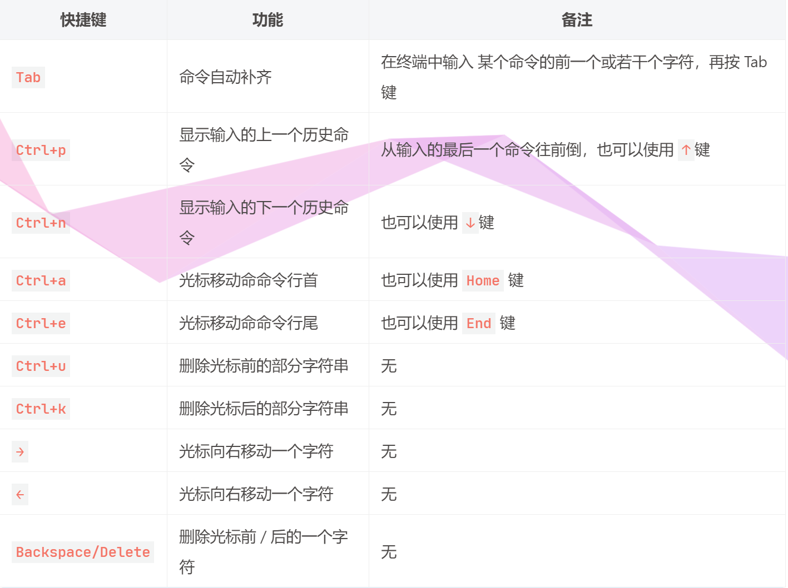

# 1. Linux 介绍

## 1.1 Linux 的诞生

1991 年，GNU 计划已经开发出了许多工具软件，最受期盼的 GNU C 编译器已经出现，GNU 的操作系统核心 HURD 一直处于实验阶段 (GNU 工程从 1984 年起就在做这件事)，没有任何可用性，实质上也没能开发出完整的 GNU 操作系统。

也是这一年，Linux 诞生了，Linux 是 UNIX 操作系统的一个克隆系统, 但是Linux是开源的。 那时候它只是一个系统内核，没有与之配套的应用软件，这时候 Linux 和 GNU 一拍即合，就有了我们现在使用的操作系统，GNU 奠定了 Linux 用户基础和开发环境。


- **Linux 时间线**
    - 1991 年初，林纳斯・托瓦兹开始在一台 386sx 兼容微机上学习 minix 操作系统。
    - 1991 年 4 月，林纳斯・托瓦兹开始酝酿并着手编制自己的操作系统。
    - 1991 年 4 月 13 日在 comp.os.minix 上发布说自己已经成功地将 bash 移植到了 minix 上，而且已经爱不释手、不能离开这个 shell 软件了。
    - 1991 年的 10 月 5 日，林纳斯・托瓦兹在 comp.os.minix 新闻组上发布消息，正式向外宣布 Linux 内核的诞生。
    - <u>1992 年 Linux 与其他 GNU 软件结合，完全自由的操作系统正式诞生。该操作系统往往被称为 “GNU/Linux”</u>。
    - 1993 年，大约有 100 余名程序员参与了 Linux 内核代码编写 / 修改工作，其中核心组由 5 人组成，此时 Linux 0.99 的代码大约有十万行，用户大约有 10 万左右。
    - 1994 年 3 月，Linux1.0 发布，代码量 17 万行，当时是按照完全自由免费的协议发布，随后正式采用 GPL 协议。
- **Linux 主要特性**
    - <u>Linux 是一个**基于文件**的操作系统</u>：
        操作系统需要和硬件进行交互，对应 Linux 来说这些硬件都是文件，比如：操作系统会将硬盘 , 鼠标 , 键盘 , 显示屏等抽象成一个设备文件来进行管理。
    - Linux 操作系统是一种自由软件，是免费的，并且公开源代码。
    - 可以同时登陆多个用户，并且每个用户可以同时运行多个应用程序。
    - 提供了友好的图形用户界面，操作简单， 易于快速上手。
    - 支持多平台（这里指的是基于不同 CPU 架构的平台，比如国产 Linux 使用的龙芯等）。


## 1.2 一些名词

- `GNU`：Gnu’s Not Unix. 可以理解成一种口号，最早由 Richard Stallman 呼吁并倡导的，号召软件自由。
- `GPL`：General Public License. GNU 通用公共许可证，GPL 授予程序的接受方下述的权利，即 GPL 所倡导的 “自由”：
    - 可以以任何目的运行所购买的程序；
    - 在得到程序代码的前提下，可以以学习为目的，对源程序进行修改；
    - 可以对复制件进行再发行；
    - 对所购买的程序进行改进，并进行公开发布。
- `LGPL(GNU Lesser General Public License)`: LGPL 是 GPL 的一个为主要为类库使用设计的开源协议。
    - LGPL 允许商业软件通过类库引用 (link) 方式使用 LGPL 类库而不需要开源商业软件的代码。
    - 采用 LGPL 协议的开源代码可以被商业软件作为类库引用并发布和销售。
- `BSD开源协议`: BSD 开源协议是一个给于使用者很大自由的协议。基本上使用者可以” 为所欲为”，以 BSD 协议代码为基础做二次开发自己的产品时，需要满足三个条件：
    - 如果再发布的产品中包含源代码，则在源代码中必须带有原来代码中的 BSD 协议。
    - 不可以用开源代码的作者 / 机构名字和原来产品的名字做市场推广。
    - BSD 代码鼓励代码共享，但需要尊重代码作者的著作权。
- `FSF`：自由软件基本会，给 GNU 提供资金支付的，毕竟没钱难成事啊。
- 自由软件：GNU 项目下的所有软件都基于 GPL 许可证（非 GNU 项目也可使用 GPL），都是自由软件。
- 开源软件：是美国 Open Source Initiative 协会定义，软件开放源代码。
- `POSIX`：（Portable Operating System Interface for Computing Systems）是由 IEEE 和 ISO/IEC 开发的一套标准。POSIX 标准是对 UNIX 操作系统的经验和实践的总结，对操作系统调用的服务接口进行了标准化，保证所编制的应用程序在源代码一级可以在多种操作系统上进行移植。


## 1.3 Linux 发行版

> Linux 的发行版本众多，曾有人收集过超过 300 种的发行版本。这里对最常用的发行版本进行简单的介绍，下表 为用户经常使用的版本。大家可以去相关网址查找，选择适合的版本使用。


## 1.4 Linux 内核

Linux 系统从应用角度来看，分为**内核空间**和**用户空间**两个部分。内核空间是 Linux 操作系统的主要部分，但是仅有内核的操作系统是不能完成用户任务的。丰富并且功能强大的应用程序包是一个操作系统成功的必要件。这个和武林秘籍一样，不仅得有招式还得有内功心法。

Linux 的内核主要由 5 个子系统组成：**进程调度、内存管理、虚拟文件系统、网络接口、进程间通信**。下面将依次讲解这 5 个子系统。

- **进程调度 SCHED**
    - 进程调度指的是系统对进程的多种状态之间转换的策略。Linux 下的进程调度有 3 种策略：SCHED_OTHER、SCHED_FIFO 和 SCHED_RR。
    - SCHED_OTHER：分时调度策略（默认），是用于针对普通进程的时间片轮转调度策略。
    - SCHED_FIFO：实时调度策略，是针对运行的实时性要求比较高、运行时间短的进程调度策略
    - SCHED_RR：实时调度策略，是针对实时性要求比较高、运行时间比较长的进程调度策略。
- **内存管理 MMU**
    - 内存管理是多个进程间的内存共享策略。在 Linux 中，内存管理主要说的是虚拟内存。
    - 虚拟内存可以让进程拥有比实际物理内存更大的内存，可以是实际内存的很多倍。
    - 每个进程的虚拟内存有不同的地址空间，多个进程的虚拟内存不会冲突。
- **虚拟文件系统 VFS**
    - 在 Linux 下支持多种文件系统，如 ext、ext2、minix、umsdos、msdos、vfat、ntfs、proc、smb、ncp、iso9660、sysv、hpfs、affs 等。
    - 目前 Linux 下最常用的文件格式是 ext2 和 ext3。
- **网络接口**
    - Linux 是在 Internet 飞速发展的时期成长起来的，所以 Linux 支持多种网络接口和协议。网络接口分为网络协议和驱动程序，网络协议是一种网络传输的通信标准，而网络驱动则是对硬件设备的驱动程序。Linux 支持的网络设备多种多样，几乎目前所有网络设备都有驱动程序。
- **进程间通信**
    - Linux 操作系统支持多进程，进程之间需要进行数据的交流才能完成控制、协同工作等功能，Linux 的进程间通信是从 UNIX 系统继承过来的。Linux 下的进程间的通信方式主要有管道、信号、消息队列、共享内存和套接字等方法。


# 2. Linux 目录

与 Windows 下的文件组织结构不同，Linux 不使用磁盘分区符号来访问文件系统，而是将整个文件系统表示成树状的结构，Linux 系统每增加一个文件系统都会将其加入到这个树中。
操作系统文件结构的开始，只有一个单独的顶级目录结构，叫做根目录。所有一切都从“根”开始，用“/”代表，并且延伸到子目录。Linux 则通过 “挂接” 的方式把所有分区都放置在 “根” 下各个目录里。一个 Linux 系统的文件结构如下图所示。


## 2.1 Linux目录结构


在 linux 中根目录的子目录结构相对是固定的 (名字固定), 不同的目录功能是也是固定的：

- bin: binary, 二进制文件目录，存储了可执行程序，今天要将的命令对应的可执行程序都在这个目录中
- sbin: super binary, root 用户使用的一些二进制可执行程序
- etc: 配置文件目录，系统的或者用户自己安装的应用程序的配置文件都存储在这个目录中
- lib: library, 存储了一些动态库和静态库，给系统或者安装的软件使用
- media: 挂载目录，挂载外部设备，比如：光驱，扫描仪
- mnt: 临时挂载目录，比如我们可以将 U 盘临时挂载到这个目录下
- proc: 内存使用的一个映射目录，给操作系统使用的
- tmp: 临时目录，存放临时数据，重启电脑数据就被自动删除了
- boot: 存储了开机相关的设置
- home: 存储了普通用户的家目录，家目录名和用户名相同
- root: root 用户的家目录
- dev: device , 设备目录，Linux 中一切皆文件，所有的硬件会抽象成文件存储起来，比如：键盘， 鼠标
- lost+found: 一般时候是空的，电脑异常关闭 / 崩溃时用来存储这些无家可归的文件，用于用户系统恢复
- opt: 第三方软件的安装目录
- var: 存储了系统使用的一些经常会发生变化的文件， 比如：日志文件
- usr: unix system resource, 系统的资源目录
    - /usr/bin: 可执行的二进制应用程序
    - /usr/games: 游戏目录
    - /usr/include: 包含的标准头文件目录
    - /usr/local: 和 opt 目录作用相同，安装第三方软件

> 对于用户自己的文件，一般都是存放到自己的家目录中，也就是 /home/用户名里边，通过指定的相应的路径就可以找到这个文件了。关于路径的指定的有两种方式：相对路径和绝对路径。

````shell
# 这是在root用户的家目录中, 并且展示了家目录中的子目录的从属关系
[root@VM-8-14-centos ~]# tree
.
|-- ace
|   `-- brother
|       `-- finally
|           `-- die.txt
`-- luffy
    `-- get
        `-- onepiece
            `-- haha.txt
````


## 2.2 相对路径

相对路径：相对路径就是相对于当前文件的路径。在 Linux 中有两个表示路径的特殊符号:

- `./`：代表目前所在的目录，也可以使用 . 表示。

- `../`：代表当前目录的上一层目录，也可以使用 .. 表示。

- 以上边的目录为例，从当前 root 家目录 /root, 进入到 onepiece 目录使用相对路径

    ````shell
    [root@VM-8-14-centos ~]# cd luffy/get/onepiece/
    ````

接下来研究一下相对路径的优缺点:

- 优点：简洁，目录相对较短，书写方便
- 缺点：变更工作目录之后，使用相同的相对路径就找不到原来的文件了


## 2.3 绝对路径

绝对路径：从系统磁盘起始节点开始描述的路径。

- Linux：起始节点为根目录，比如： /root/luffy/get/onepiece


- Windows: 起始节点为某个磁盘的盘符，比如：f:\\root\\luffy\\get\\onepiece


- 以上边的目录为例，从当前 root 家目录 /root, 进入到 onepiece 目录使用绝对路径

    ````shell
    [root@VM-8-14-centos ~]# cd /root/luffy/get/onepiece/
    ````

接下来研究一下绝对路径的优缺点:

- 优点：在操作系统的任意位置都可以通过绝对路径访问到对应的文件

- 缺点：字符串较长，书写起来比较麻烦，看起来也不够简洁


# 3. 命令解析器

在 Linux 中需要通过终端执行对应的命令来完成某些操作，那么这些命令是如何被执行的呢？

这些命令都是通过命令解析器解析完成并执行的，如果用户在终端输入是正确的内部指令，命令解析器就执行这个命令，如果不是正确的指令，则提示命令无法解析。

下图是 Windows 是命令行窗口，平台虽然不同但是命令解析器的工作原理是相同的。


## 3.1 工作原理

命令解析器在 Linux 操作系统中就是一个进程 (运行的应用程序), 它的名字叫做 bash 通常我们更习惯将其称之为 shell (即: sh)。他们之间的渊源是这样的，在 Unix 操作系统诞生之后一个叫伯恩 (Bourne) 的人为其编写了命令解析器取名为 shell, Linux 操作系统诞生之后伯恩再次改写了 shell (sh), 将其称之为 bash (Bourne Again SHell), bash 就是 sh 的增强版本。

在 Linux 操作系统中默认使用的命令解析器是 bash, 当然也同样支持使用 sh。当用户打开一个终端窗口，并输入相关指令， 按回车键， 这时候命令解析器就开始工作了， 具体步骤如下：

- 在 Linux 中有一个叫做 PATH 的环境变量，里边存储了一些系统目录 (windows也有, 叫 Path)

    ````shell
    # 通过 echo 命令可以查看环境变量 PATH 中的值, 在shell中变量名前加 $ 就是取值
    [root@VM-8-14-centos ~]# echo $PATH
    /usr/local/sbin:/usr/local/bin:/usr/sbin:/usr/bin:/root/bin
    ````

- 命令解析器需要依次搜索 PATH 中的各个目录，检查这些目录中是否有用户输入的指令

    - 如果找到了，执行该目录下的可执行程序，用户输入的命令就被执行完毕了

    - 如果没有找到，继续搜索其他目录，最后还是没有找到，会提示命令找不到，因此无法被执行

        ````shell
        [root@VM-8-14-centos ~]# asdjflksd
        -bash: asdjflksd: command not found
        ````

        

## 3.2 命令提示行

在 Linux 终端中，输入要执行的指令之前会有想用的命令提示，我们将其称之为命令提示行，例如:

````sh
[root@VM-8-14-centos ~/luffy/get/onepiece]#
[robin@VM-8-14-centos ~/luffy/get/onepiece]$ 
````

- `root` : 当前登录的用户的用户名
- `@`: at -> 在
- `VM-8-14-centos`: 主机名，在安装这个 linux 操作系统的时候手动指定，可以修改
    - `~`: 当前用户的家目录
        - 在 linux 中有很多用户，每个用户都用一个属于自己的目录，这个目录称之为家目录
        - 普通用户家目录` /home/`用户名 , root 用户家目录` /root`
    - `~/luffy/get/onepiece`: 当前用户所在的工作目录，也可以使用 pwd 命令查看
    - `#`: 代表当前用户是 root 用户
    - `$`: 当前用户是普通用户，也就是说例子中的 `robin` 是一个普通用户


## 3.3 命令行快捷键

我们在命令行输入一些指令的时候，经常需要移动光标，或者删除一些字符，对应的一些快捷键操作如下表:



> 关于 Tab 的补充:
>
> - 由于很定shell命令的开头字母是相同的, 在这种情况下, 按一次Tab是不会自动补齐的，我们可以连续按两次Tab键，在当前终端中就可以显示出所有匹配成功的shell命令
> - 为了能够快速补全 shell 指令，我们可以多输入一些前缀字符之后，再按 Tab 键


