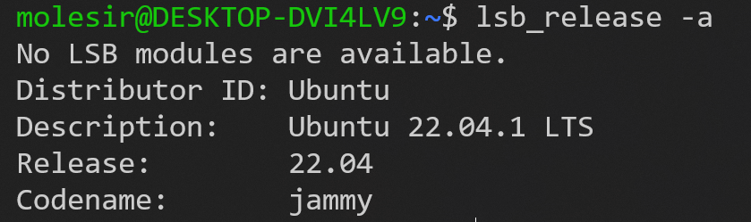

# Linux 软件包管理命令

## 软件源

在 /etc/apt/ 目录下有一个 sources.list 文件，其中包含很多资源网站，在 Linux 中下载软件包时，就来到此文件中记录的网站去寻找；

一般默认安装 Linux 后，其中的资源网站都是外网，需要替换为国内的镜像才能比较快速的下载软件包；

而替换规则规则不是直接复制粘贴那么简单，对 Ubuntu 来说，每次更新都会有一个版本号，使用以下命令查看，当前的 Ubuntu 版本：

````bash
lsb_release -a
````



其中的 `Codename` 就时版本代号；

然后到阿里云镜像官网查看，这个版本有没有镜像文件 ：[ubuntu-dists安装包下载_开源镜像站-阿里云 (aliyun.com)](http://mirrors.aliyun.com/ubuntu/dists/)；

如果存在的话，到 /etc/apt/sources.list 文件中，把下面这些网站拷贝进去，将其中的 `TODO` 全部替换为版本号，比如这里就是 `jammy`；

````tex
deb http://mirrors.aliyun.com/ubuntu/ TODO main restricted universe multiverse
deb-src http://mirrors.aliyun.com/ubuntu/ TODO main restricted universe multiverse

deb http://mirrors.aliyun.com/ubuntu/ TODO-security main restricted universe multiverse
deb-src http://mirrors.aliyun.com/ubuntu/ TODO-security main restricted universe multiverse

deb http://mirrors.aliyun.com/ubuntu/ TODO-updates main restricted universe multiverse
deb-src http://mirrors.aliyun.com/ubuntu/ TODO-updates main restricted universe multiverse

deb http://mirrors.aliyun.com/ubuntu/ TODO-proposed main restricted universe multiverse
deb-src http://mirrors.aliyun.com/ubuntu/ TODO-proposed main restricted universe multiverse

deb http://mirrors.aliyun.com/ubuntu/ TODO-backports main restricted universe multiverse
deb-src http://mirrors.aliyun.com/ubuntu/ TODO-backports main restricted universe multiverse

````


## apt 命令

**apt（Advanced Packaging Tool）**是一个在 Debian 和 Ubuntu 中的 **Shell 前端软件包管理器**；

apt 命令提供了查找、安装、升级、删除某一个、一组甚至全部软件包的命令，而且命令简洁而又好记。

apt 命令执行需要超级管理员权限(root)。

### apt 语法

````bash
apt [options] [command] [package ...]
````

- `options`：可选，选项包括 -h（帮助），-y（当安装过程提示选择全部为"yes"），-q（不显示安装的过程）等等。
- `command`：要进行的操作。
- `package`：安装的包名。

### apt 常用命令

- 列出所有可更新的软件清单命令：`sudo apt update`

- 升级软件包：`sudo apt upgrade`

  - 列出可更新的软件包及版本信息：`apt list --upgradeable`
  - 升级软件包，升级前先删除需要更新软件包：`sudo apt full-upgrade`

- :star:安装指定的软件命令：`sudo apt install <package_name>`

  :star:安装多个软件包：`sudo apt install <package_1> <package_2> <package_3>`

- 更新指定的软件命令：`sudo apt update <package_name>`

- 显示软件包具体信息,例如：版本号，安装大小，依赖关系等等：`sudo apt show <package_name>`

- :star:删除软件包命令：`sudo apt remove <package_name>`

- 清理不再使用的依赖和库文件: `sudo apt autoremove`

- 移除软件包及配置文件: `sudo apt purge <package_name>`

- 查找软件包命令： `sudo apt search <keyword>`

- 列出所有已安装的包：`apt list --installed`

- 列出所有已安装的包的版本信息：`apt list --all-versions`


## apt-get 命令

**apt-get**，是一条linux命令，适用于deb包管理式的操作系统，主要用于自动从互联网的软件仓库中搜索、安装、升级、卸载软件或操作系统，是一款适用于Unix和Linux系统的应用程序管理器。

使用命令与 apt基本一致，就是把 apt 改为 apt-get；

但 apt 有些功能，apt-get 没有，所以现在都推荐使用 apt，而不是 apt-get。

