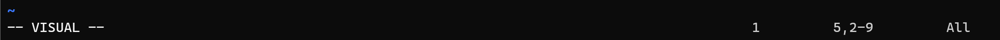
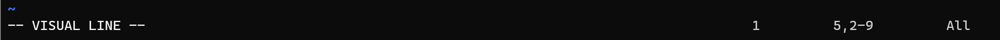
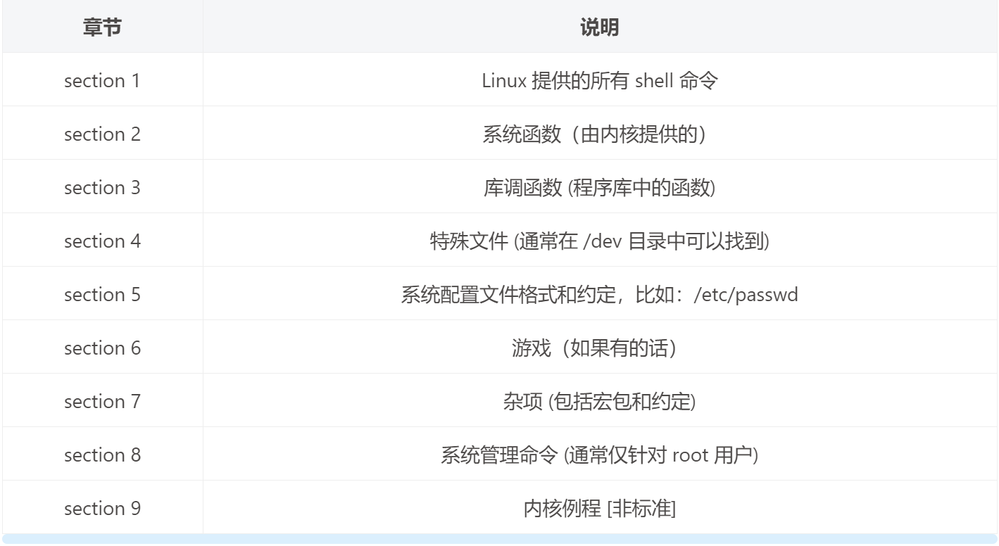
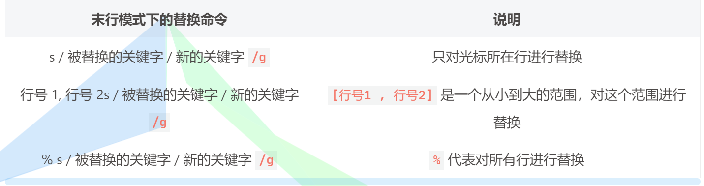
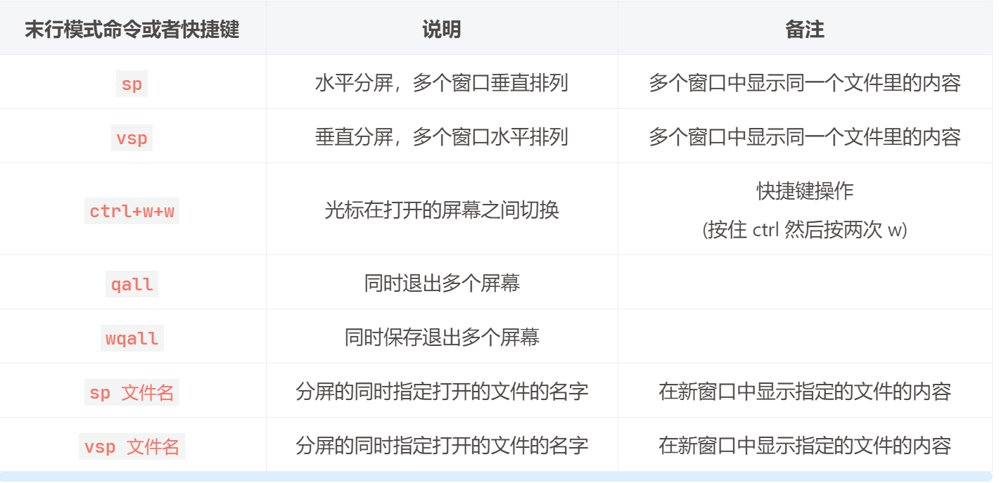

# 1. vim 的安装

Vim 是 Linux 操作系统中一款功能强大的文本编辑器，支持安装各种插件。但是 vim 和 windows 中的文件编辑器所不同的是它没有 UI 界面，所有的操作都是通过键盘快捷键操作完成的；

如果我们拿到了一个纯净版的 Linux, 里边是没有 vim 的，但是有一个类似的文本编辑器叫做 Vi。vi 编辑器的功能不是很强，可以这样理解 vim 就是 vi 的增强版。

在线安装 vim，软件安装，需要管理员权限:

- Ubuntu

    ````shell
    $ sudo apt install vim		# 如果是root用户就不用加 sudo 了
    ````

- CentOS

    ````shell
    $ sudo yum install vim		# 如果是root用户就不用加 sudo 了
    ````

vim 安装完毕之后，可以先查看一下版本 (在线安装不能保证安装的软件是最新版本)

````shell
$ vim --version
````

另外 vim 还提供了使用文档，直接在终端执行下面的命令就可以打开

````sh
$ vimtutor
````

---


# 2. vim 的模式

在 vim 中一共有三种模式，分别是 **命令模式 , 末行模式 , 编辑模式**，打开 vim 之后默认进入的是命令模式；

- **命令模式**：在该模式下我们可以进行<u>查看文件内容 , 修改文件 , 关键的搜索</u>等操作。
- **编辑模式**：在该模式下主要<u>对文件内容进行修改和内容添加</u>。
- **末行模式**：在该模式下可以进行<u>执行Linux命令 , 保存文件 , 进行行的跳转 , 窗口分屏等操作</u>。

以上三种模式之间是可以相互切换的：

- 命令模式 -> 编辑模式 -> 命令模式
- 命令模式 -> 末行模式 -> 命令模式
- 编辑模式和末行模式之间是不能相互直接切换的


----


# 3. 命令模式下的操作

通过 vim 打开一个文件，如果文件不存在，在退出的时候进行了保存，文件就会被创建出来

````shell
# 打开一个文件
$ vim 文件名
````

---


## 3.1 保存退出

直接在键盘上操作，通过键盘按两个连续的大写的 Z (此处是大写的Z, 需要先按住 Shift )

````shell
# 先按住 shift 键, 然后连续按两次 z
ZZ
````

---


## 3.2 代码格式化

在编码过程中，为了便于阅读和代码维护，代码都需要按照样式对其，如果代码格式凌乱，可以在命令模式下快速进行代码的格式化，让其看起来更加美观，这个操作需要在键盘上连续输入多个字符。

````shell
# 假设写的c/c+代码没有对齐, 通过该命令可以对齐代码
# 一定要注意最后一个字符是 大写的 G, 因此需要先按 shift
gg=G
````

---


## 3.3 光标移动

在 vim 中可以使用键盘上的方向键 (↑, ↓, ←, →) 来移动光标，这种操作相对比较麻烦， 有一种更加简便的操作方式， 就是使用键盘上的 h, j, k, l。

````shell
# 标准的移动光标的方法: 使用 h, j, k, l

                                        光标上移   
                                           ↑
                                           |
                     光标左移 <-- h    j    k    l --> 光标右移
                                       |
                                       ↓
                                    光标下移    
````

除此之外我们还可以使用一些快捷键实现光标的快速跳转，常用的有:

|  快捷键  |        功能        |                      备注                       |
| :------: | :----------------: | :---------------------------------------------: |
|   `0`    |   光标移动到行首   |                       无                        |
|   `$`    |  光标移动到行尾部  |              选按两个键: shift + 4              |
|   `gg`   |  光标移动到文件头  |                  第一行的开始                   |
|   `G`    | 光标移动到文件尾部 |                 最后一行的开始                  |
|   `nG`   |       行跳转       |              n 代表要跳转到哪一行               |
| `n+回车` |   相对跳转 n 行    | 从光标所在当前行往下跳 n 行，n 对应的是一个整数 |

---


## 3.4 删除命令

在 vim 中是没有删除操作的，其实所谓的删除就是剪切，被删除的数据都可被粘贴到文档的任意位置，即便如此我们还是习惯性的将剪切操作称之为删除，常用的删除操作如下表所示:

|  快捷键   |        功能        |                          备注                           |
| :-------: | :----------------: | :-----------------------------------------------------: |
| `x(小写)` | 删除光标后边的字符 |           vim 中的光标比较宽会盖住后边的字符            |
| `X(大写)` | 删除光标前边的字符 |                           无                            |
|   `dw`    |      删除单词      |        要先把光标移动到单词的第一个字母上再删除         |
|   `d0`    | 删除光标前的字符串 |       从字符串开头到光标当前位置的字符串被删除了        |
| `d$ (D)`  | 删除光标后的字符串 | 从光标当前位置到字符串尾部的字符串被删除了，使用 D 也行 |
|   `dd`    |   删除光标所在行   |                           无                            |
|   `ndd`   |      删除n行       |      从光标所在行开始删除 n 行，n 对应的是一个整数      |

----


## 3.5 撤销和反撤销

撤销和反撤销对应 windows 中的 ctrl+z 和 ctrl+y, 但是在 vim 中使用这两个快捷键是不行的。

|   快捷键   |  功能  |            备注            |
| :--------: | :----: | :------------------------: |
|    `u`     |  撤销  | 等价于 windows 中的 ctrl+z |
| `ctrl + r` | 反撤销 | 等价于 windows 中的 ctrl+y |

---


## 3.6 复制和粘贴

前边已经介绍了，在 vim 中做删除操作就相当于剪切，剪切或者复制之后的数据都可以用来做粘贴操作，在 vim 中对应的快捷键如下:

| 快捷键 |           功能            |             备注              |
| :----: | :-----------------------: | :---------------------------: |
|  `p`   |  粘贴到光标所在行的下边   |           小写的 p            |
|  `P`   |  粘贴到光标所在行的上边   |           大写的 P            |
|  `yy`  |      复制光标所在行       |              无               |
| `nyy`  | 从光标所在行向下复制 n 行 | n是要复制的行数, 代表一个整数 |

---


## 3.7 可视模式

在编辑文件的过程中，有时候需要删除或者需要复制的数据不整行的，而是一行中的某一部分，这时候可以使用可视模式进行文本的选择，之后再通过相关的快捷键对所选中的数据块进行复制或者删除操作。

有三种方式可以切换到可视模式:

- `v`： 进入的字符可视化模式（Characterwise visual mode)，文本选择是以字符为单位的。
- `V` ：进入的行可视化模式（Linewise visual mode)，文本选择是以行为单位的。
- `ctrl-v`： 进入的块可视化模式（Blockwise visual mode），可以选择一个矩形内的文本。


进入到可视模式之后，就可以进行文本块的选择和复制以及删除了


---

### 3.7.1 字符可视模式

控制光标方向用来选择文件中的不规则数据块，可以对选中的文本信息进行复制和删除

````shell
# 进入到字符可视模式，直接在键盘上按 v 即可: 
v
````

通过 v 切换到字符可视模式之后， 在窗口的最下方会看到 -- VISUAL-- 字样。



----

### 3.7.2 行可视模式

向下移动光标可以选择一整行，向上移动光标可以取消整行选择

````sh
# 进入行可视模式, 键盘上按 shift+v 
V
````

通过 V 切换到行可视模式之后， 在窗口的最下方会看到 -- VISUAL LINE -- 字样。



---

### 3.7.3 块可视化模式

通过向上，下移动光标控制矩形文本块的高度，通过向左，右移动光标控制矩形文本块的宽度。

````sh
# 进入块可视模式, 选择一个矩形文本块
ctrl+v
````

通过 ctrl+v 切换到块可视模式之后， 在窗口的最下方会看到 -- VISUAL BLOCK -- 字样。

---

### 3.7.4 代码注释

代码块注释可以使用块可视模式，具体操作步骤如下：

1. 通过 ctrl+v 进入块可视模式
2. 移动光标上移（k）或者下移（j），选中多个代码行的开头
3. 选择完毕后，按大写的的 I 键，此时下方会提示进入 “insert” 模式，输入你要插入的注释符，例如: //
4. 最后按 ESC 键，你就会发现选中的多行代码已经被注释了

---


## 3.8 替换

命令模式下的替换功能并不强，常用于某个单字符的替换。

| 快捷键 |         功能         |      备注       |
| :----: | :------------------: | :-------------: |
|  `r`   | 替换光标后的单个字符 |       无        |
|  `R`   | 替换光标后的多个字符 | 按 esc 结束替换 |

---


## 3.9 查找

在 vim 的命令模式下一共有三种查找方式，首先需要在键盘上输入对应的字符，然后按回车键 vim 会进行关键字匹配，之后就可以通过 n 或者 N 进行关键字之间的切换了。


---


## 3.10 查看 man 文档

man 文档，是 Linux 中默认自带的帮助文档，作为程序猿可以通过这个文档来查询 shell 命令或者标准 API 函数或者系统自带的配置文件格式的说明等信息。



````sh
# 打开 man 文档首页
$ man man
# 退出 man 文档，直接按键盘上的 q 即可
q
````

如何通过 man 文档查询相关的 shell 命令或者函数等信息：

````sh
# 下边举几个例子:

# 查询第一章的shell命令
$ man 1 cp

# 查询第二章的系统函数 (如: read, write, open 等)
$ man 2 read

# 查询第三章的标准的库函数 (如: fread, fwrite, fopen 等)
$ man 3 fread

# 查询第五章的特殊的配置文件说明, 比如: /etc/passwd 或者 /etc/group
$ man 5 passwd
````

----


## 3.11 切换到编辑模式

如果要编辑文件，需要从命令模式切换到文件编辑模式，切换模式的快捷键有很多，不同的快捷键对应的效果有所不同，效果如下表所示：

| 快捷键 |                           功能                            |
| :----: | :-------------------------------------------------------: |
|  `i`   |                    从光标前边开始输入                     |
|  `a`   |                   从光标的后边开始输入                    |
|  `o`   |             在光标下边创建新行，在新行中输入              |
|  `s`   | 删除光标后边的字符 (盖住的字符), 从删除的字符位置开始输入 |
|  `I`   |                   从当前行行首开始输入                    |
|  `A`   |                   从当前行行尾开始输入                    |
|  `O`   |             在光标上边创建新行，在新行中输入              |
|  `S`   |               删除当前行，在当前行开始输入                |

文件编辑完成之后，从编辑模式回到命令模式只需要按键盘上的 Esc 即可

---


# 4. 末行模式下的操作

## 4.1 命令模式到末行模式

从命令模式切换到末行模式只需要在键盘上输入一个 :，同时这个符号也会出现在窗口的最下端，这时候我们就可以在最后一行输入我们执行的命令了。

````shell
# 命令模式切换到末行模式
在命令模式下键盘输入一个 冒号  -> :

# 从末行模式 -> 命令模式
1. 按两次esc
2. 在末行模式下执行一个完整指令, 执行完毕, 自动回到命令模式
````

> 从末行模式切换回命令模式有两种方式：
>
> 按两次 Esc
> 在末行模式下执行一个完整指令，执行完毕，自动回到命令模式

---


## 4.2 保存退出

使用 vim 对文件编辑完成之后，需要保存或者退出 vim 一般都是在末行模式下完成的，不管是进行那种操作都有对应的操作命令，如下表:

| 末行模式下输入的命令 |                          功能                          |
| :------------------: | :----------------------------------------------------: |
|         `q`          | 退出，如果退出的时候文件没有保存，vim 会提示是否要保存 |
|         `!q`         |              直接退出，不保存 (强制退出)               |
|         `w`          |     保存，不退出 (相当在 windows 中于按了 ctrl+s)      |
|         `wq`         |                        保存退出                        |
|         `x`          |                        保存退出                        |

---


## 4.3 替换

末行模式下的替换比命令模式下的替换功能要强大的多，在末行模式下可以指定将什么样的内容替换为什么样的内容，并且可以指定替换某一行或者某几行或者是全文替换。

替换对应的命令是 s 并且可以给其指定参数，默认情况下只替换相关行的第一个满足条件的关键字， 如果需要整行替换需要加参数 /g。



---


## 4.4 分屏

分屏就是将当前屏幕中的窗口以水平或者垂直的方式拆分成多个，在不同的子窗口中可以显示同一个文件或者不同文件中的内容，下边相关的分屏命令：



除了在命令模式下分屏，我们也可以在使用 vim 打开文件的时候直接分屏，下边是需要用到的参数

- -o: 水平分屏
- -O: 垂直分屏

````sh
# 在vim打开文件的时候指定打开多个文件和分屏方式
# 水平分屏
$ vim -o 文件1, 文件2, 文件3 ...
# 垂直分屏
$ vim -O 文件1, 文件2, 文件3 ...
````

---


## 4.5 行跳转

在 vim 中不仅可以在命令模式下进行行的跳转，也可以在末行模式下进行行跳转，末行模式下指定哪一行光标就可以跳转到哪一行。

````sh
:行号   # 输入完行号之后敲回车
````

---


## 4.6 执行 shell 命令

在使用 vim 编辑文件的过程中，还可以在末行模式下执行需要的 shell 命令，在执行 shell 命令之前需要在前边加上一个叹号 !。

````shell
# 语法:
:!shell命令

# 举例
:!ls		# 回车即可
````

---


