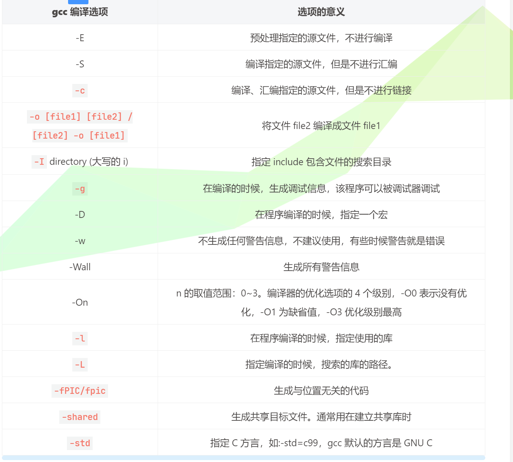

# GCC 

==GCC== 是 Linux 下的编译工具集，是 GNU Compiler Collection 的缩写，包含 gcc、g++ 等编译器。这个工具集不仅包含编译器，还包含其他工具集，例如 ar、nm 等。

GCC 工具集不仅能编译 C/C++ 语言，其他例如 Objective-C、Pascal、Fortran、Java、Ada 等语言均能进行编译。GCC 在可以根据不同的硬件平台进行编译，即能进行交叉编译，在 A 平台上编译 B 平台的程序，支持常见的 X86、ARM、PowerPC、mips 等，以及 Linux、Windows 等软件平台。


## 1. 安装 GCC

有些纯净版的 Linux 默认没有 gcc 编译器，需要自己安装，在线安装步骤如下：

````shell
# 安装软件必须要有管理员权限
# ubuntu
$ sudo apt update   		# 更新本地的软件下载列表, 得到最新的下载地址
$ sudo apt install gcc g++	# 通过下载列表中提供的地址下载安装包, 并安装

# centos
$ sudo yum update   		# 更新本地的软件下载列表, 得到最新的下载地址
$ sudo yum install gcc g++	# 通过下载列表中提供的地址下载安装包, 并安装
````

gcc 安装完毕之后，可以查看版本:

````sh
# 查看 gcc 版本
$ gcc -v
$ gcc --version

# 查看 g++ 版本
$ g++ -v
$ g++ --version
````


## 2. gcc 工作流程

> GCC 编译器对程序的编译下图所示，分为 4 个阶段：预处理（预编译）、编译和优化、汇编和链接。GCC 的编译器可以将这 4 个步骤合并成一个。

1. **预处理**：在这个阶段主要做了三件事: 展开头文件 、宏替换 、去掉注释行
    这个阶段需要 GCC 调用预处理器来完成，最终得到的还是源文件，文本格式
2. **编译**：这个阶段需要 GCC 调用编译器对文件进行编译，最终得到一个汇编文件
3. **汇编**：这个阶段需要 GCC 调用汇编器对文件进行汇编，最终得到一个二进制文件
4. **链接**：这个阶段需要 GCC 调用链接器对程序需要调用的库进行链接，最终得到一个可执行的二进制文件

| 文件后缀名 |              说明              | gcc参数 |
| :--------: | :----------------------------: | :-----: |
|    `.c`    |             源文件             |   无    |
|    `.i`    |       预处理后的 C 文件        |  `-E`   |
|    `.s`    | 编译之后得到的汇编语言的源文件 |  `-S`   |
|    `.o`    |     汇编后得到的二进制文件     |  `-c`   |


在 Linux 下使用 GCC 编译器编译单个文件十分简单，直接使用 gcc 命令后面加上要编译的 C 语言的源文件，GCC 会自动生成文件名为 a.out 的可执行文件（也可以通过参数 -o 指定生成的文件名），也就是通过一个简单的命令上边提到的 4 个步骤就全部执行完毕了。但是如果想要单步执行也是没问题的， 下边演示：

````c
// 源文件
#include <stdio.h>

int main(void)
{
        printf("hello world!\n");
        return 0;
}
````

- 第一步：对源文件进行预处理，需要使用的 gcc 参数为 -E

    ````sh
    # 1. 预处理, -o 指定生成的文件名
    $ gcc -E hello.c -o hello.i
    ````

- 第二步：编译预处理之后的文件，需要使用的 gcc 参数为 -S

    ````shell
    # 2. 编译, 得到汇编文件
    $ gcc -S hello.i -o hello.s
    ````

- 第三步：对得到的汇编文件进行汇编，需要使用的 gcc 参数为 -c

    ````sh
    # 3. 汇编
    $ gcc -c hello.s -o hello.o
    ````

- 第四步：将得到的二进制文件和标准库进制链接，得到可执行的二进制文件，不需要任何参数

    ````sh
    # 4. 链接
    $ gcc hello.o -o hello
    ````

最后再次强调，在使用 gcc 编译程序的时候可以通过参数控制内部自动执行几个步骤：

````sh
# 参数 -c 是进行文件的汇编, 汇编之前的两步会自动执行
$ gcc test.c -c -o app.o

# 该命令是直接进行链接生成可执行程序, 链接之前的三步会自动执行
$ gcc test.c -o app    
````


## 3. gcc 常用参数

下面的表格中列出了常用的一些 gcc 参数，这些参数在 gcc命令中没有位置要求，只需要编译程序的时候将需要的参数指定出来即可。



### 3.1 指定生成的文件名 (-o)

该参数用于指定原文件通过 gcc 处理之后生成的新文件的名字，有两种写法，原文件可以写在参数 -o 前边后缀写在后边：

````sh
# 参数 -o的用法 , 原材料 test.c 最终生成的文件名为 app
# test.c 写在 -o 之前
$ gcc test.c -o app

# test.c 写在 -o 之后
$ gcc -o app test.c
````

### 3.2 搜索头文件 (-I)

如果在程序中包含了一些头文件，但是包含的一些头文件在程序预处理的时候因为找不到无法被展开，导致程序编译失败，这时候我们可以在 gcc 命令中添加 -I 参数重新指定要引用的头文件路径，保证编译顺利完成：

````sh
# -I, 指定头文件目录
$ tree
.
├── add.c
├── div.c
├── include
│   └── head.h
├── main.c
├── mult.c
└── sub.c

# 编译当前目录中的所有源文件，得到可执行程序
$ gcc *.c -o calc
main.c:2:18: fatal error: head.h: No such file or directory
compilation terminated.
sub.c:2:18: fatal error: head.h: No such file or directory
compilation terminated.
````

通过编译得到的错误信息可以知道，源文件中包含的头文件无法被找到。通过提供的目录结构可以得知头文件 head.h 在 include 目录中，因此可以在编译的时候重新指定头文件位置，具体操作如下：

````sh
# 可以在编译的时候重新指定头文件位置 -I 头文件目录
$ gcc *.c -o calc -I ./include
````

### 3.3 指定一个宏 (-D)

在程序中我们可以使用宏定义一个常量，也可以通过宏控制某段代码是否能够被执行。在下面这段程序中第 8 行判断是否定义了一个叫做 DEBUG 的宏，如果没有定义第 9 行代码就不会被执行了，通过阅读代码能够知道这个宏是没有在程序中被定义的。

````c
// test.c
#include <stdio.h>
#define NUMBER  3

int main()
{
    int a = 10;
#ifdef DEBUG
    printf("我是一个程序猿, 我不会爬树...\n");
#endif
    for(int i=0; i<NUMBER; ++i)
    {
        printf("hello, GCC!!!\n");
    }
    return 0;
}
````

如果不想在程序中定义这个宏， 但是又想让它存在，通过 gcc 的参数 -D 就可以实现了，编译器会认为参数后边指定的宏在程序中是存在的。

````sh
# 在编译命令中定义这个 DEBUG 宏, 
$ gcc test.c -o app -D DEBUG

# 执行生成的程序， 可以看到程序第9行的输出
$ ./app 
我是一个程序猿, 我不会爬树...
hello, GCC!!!
hello, GCC!!!
hello, GCC!!!
````

> -D 参数的应用场景:
> 在发布程序的时候，一般都会要求将程序中所有的 log 输出去掉，如果不去掉会影响程序的执行效率，很显然删除这些打印 log 的源代码是一件很麻烦的事情，解决方案是这样的：
>
> - 将所有的打印 log 的代码都写到一个宏判定中，可以模仿上边的例子
>     - 在编译程序的时候指定 -D 就会有 log 输出
>     - 在编译程序的时候不指定 -D, log 就不会输出


## 4. 多文件编译

GCC 可以自动编译链接多个文件，不管是目标文件还是源文件，都可以使用同一个命令编译到一个可执行文件中：

### 4.1 准备工作

首先将程序编译之前需要的代码准备出来，例如一个项目包含 3 个文件，文件 string.h , string.c 中有一个函数 strLength 用于计算字符串的长度，而在 main.c 中调用这个函数将计算的结果显示出来

- 头文件

    ````c
    #ifndef _STRING_H_
    #define _STRING_H_
    int strLength(char *string);
    #endif // _STRING_H_
    ````

- 源文件 string.c

    ````c
    #include "string.h"
    
    int strLength(char *string)
    {
    	int len = 0;
    	while(*string++ != '\0') 	// 当*string 的值为'\0'时, 停止计算
        {
            len++;
        }
    	return len; 	// 返回字符串长度
    }
    ````

- 源文件 main.c

    ````c
    #include <stdio.h>
    #include "string.h"
    
    int main(void)
    {
    	char *src = "Hello, I'am Monkey·D·Luffy!!!"; 
    	printf("string length is: %d\n", strLength(src)); 
    	return 0;
    }
    ````

### 4.2 编译运行

因为头文件是包含在源文件中的，因此在使用 gcc 编译程序的时候不需要指定头文件的名字（在头文件无法被找到的时候需要使用参数 -I 指定其具体路径而不是名字）。我们可以通过一个 gcc 命令将多个源文件编译并生成可执行程序，也可以分多步完成这个操作：

- 接链接生成可执行程序

    ````sh
    # 直接生成可执行程序 test
    $ gcc -o test string.c main.c
    
    # 运行可执行程序
    $ ./test
    ````

- 先将源文件编成目标文件，然后进行链接得到可执行程序

    ````sh
    # 汇编生成二进制目标文件, 指定了 -c 参数之后, 源文件会自动生成 string.o 和 main.o
    $ gcc –c string.c main.c
    
    # 链接目标文件, 生成可执行程序 test
    $ gcc –o test string.o main.o
    
    # 运行可执行程序
    $ ./test
    ````


## 5. gcc 与 g++

关于对 gcc 和 g++ 很多人的理解都是比较片面的或者是对二者的理解有一些误区，下边从三个方面介绍一下二者的区别:

- 在代码编译阶段（第二个阶段）:
    - 后缀为 .c 的，gcc 把它当作是 C 程序，而 g++ 当作是 C++ 程序
    - 后缀为.cpp 的，两者都会认为是 C++ 程序，C++ 的语法规则更加严谨一些
    - g++ 会调用 gcc，对于 C++ 代码，两者是等价的，也就是说 gcc 和 g++ 都可以编译 C/C++ 代码
- 在链接阶段（最后一个阶段）:
    - gcc 和 g++ 都可以自动链接到标准 C 库
    - g++ 可以自动链接到标准 C++ 库，gcc 如果要链接到标准 C++ 库需要加参数 -lstdc++
- 关于 __cplusplus 宏的定义
    - g++ 会自动定义__cplusplus 宏，但是这个不影响它去编译 C 程序
    - gcc 需要根据文件后缀判断是否需要定义 __cplusplus 宏 （规则参考第一条）

> 综上所述：
>
> 不管是 gcc 还是 g++ 都可以编译 C 程序，编译程序的规则和参数都相同
> g++ 可以直接编译 C++ 程序， gcc 编译 C++ 程序需要添加额外参数 -lstdc++
> 不管是 gcc 还是 g++ 都可以定义 __cplusplus 宏

````sh
# 编译 c 程序
$ gcc test.c -o test	# 使用gcc
$ g++ test.c -o test	# 使用g++

# 编译 c++ 程序
$ g++ test.cpp -o test              # 使用g++
$ gcc test.cpp -lstdc++ -o test     # 使用gcc
````

