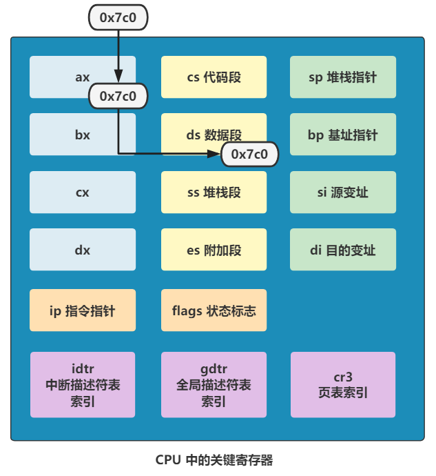
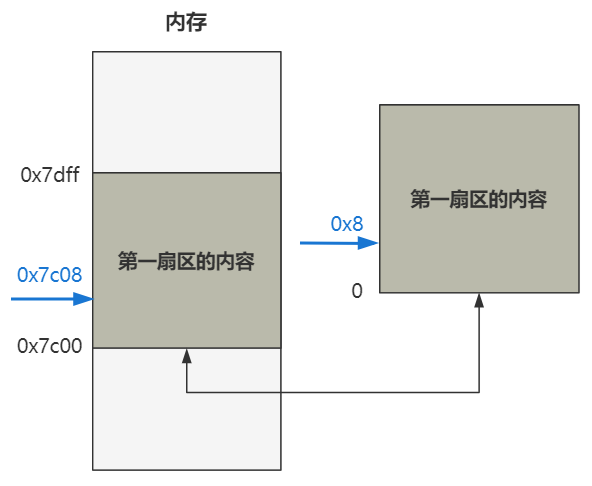

# 加载启动代码

## 1. BIOS 复制启动区

按下开机按键的一瞬间，CPU执行在主板上提取写死的固件程序 **BIOS**（注意，**BIOS** 是一段程序），这段程序将硬盘中**启动区**的 512 字节的数据复制到内存中的 0x7c00 处。之后 CPU 跳转到这个位置，即 0x7c00；


> **BIOS**：Basic Input Output System，基本输入输出系统，是一组固化道计算机内主板上的一个 ROM 芯片上的程序，保存着计算器最重要的基本输入输出程序、开机后自检程序和**系统自启动程序**；

> **启动区**：只要硬盘中的 0 盘 0 道 1 扇区的 512 字节的最后两个字节分别是 0x55 和 0xaa，那么 **BIOS** 就会认为它是个启动区；

所以作为操作系统开发人员，只要把操作系统最开始的代码，编译后并存储到 0 盘 0 道 1 扇区即可，**BIOS** 会将其复制道内存中，并且跳转执行。至于计算机如何识别代码这些工作是硬件工程师的工作；

Linux-0.11 最开始的代码，是用汇编语言写的 bootsect.s，通过编译形成了二进制文件，存放在启动区的第一扇区：


所以开机后，BIOS 将此程序搬运到内存 0x7c00 处，CPU 也会跳转至此，开始执行；


## 2. 设置寄存器

bootsect.s 的前两行：

````assembly
.equ BOOTSEG 0x07c0
mov %ax, BOOTSEG
mov %ds, %ax
````

将 0x07c0 复制到 ax 寄存器，再将 ax 寄存器的值复制到 ds 寄存器中，最后的结果是 ax、ds 寄存器都是 0x07c0；



> **ds**，是一个 16 位的段寄存器，具体表示数据段寄存器，在内存寻址时充当段基地址的作用；就是说如果我们用汇编写一个内存地址，实际上只写了偏移地址：
>
> ````assembly
> mov ax, [0x0001]
> ````
>
> 实际上应该是：
>
> ````assembly
> mov ax, [ds:0x001]
> ````
>
> 表示在 ds 寄存器中这个段基地址处，往后再偏移 0x0001，将这个地址的内存数据复制到 ax 中；

由于一些历史遗留问题，再使用 ds 中的段基地址时，需要将其左移四位，既从 0x07c0 变成 0x7c00，这个地址就是 bootsect.s 被 BIOS 加载到内存中的地址；

所以之后的内存地址，会默认加上 0x7c00 再去寻址，这样我们写的地址都只是对于 0x7c00 的偏移量；

