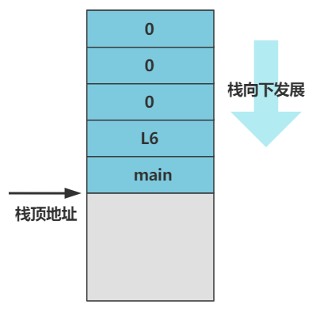

# 准备进入 main 函数

此时系统已经开启了分页，把 idt、gdt、页表、页目录表都设置号了，接下来准备进入 main 函数；

````assembly
after_page_tables:
    push 0
    push 0
    push 0
    push L6
    push _main
    jmp setup_paging
...
setup_paging:
    ...
    ret
````

当完成分页后：

- 先执行三个 `push 0`，即将 3 个 0 压入栈中；这一步相当于给 main 函数传递参数；
- 之后把 L6 页压入栈中；
- 最后把 _main 压入栈中；

执行完毕后，内存栈应该是：



完成五个压栈动作后，我们可以看到 setup_paging 的最后应该指令是 ret，返回指令令 CPU 指向当前栈顶位置去指向程序，而当前的栈顶恰好是 main 函数的入口地址；

现在程序终于正式进入 main 函数；

---


# 回顾

在进入 main 函数之前，需要完成这些步骤：

.png)

1. 开机；
2. BIOS 将启动代码 bootsect 加载到内存；
3. 开始执行 bootsect 程序：
    1. 重新复制 bootsect 程序
    2. 加载 setup 程序；
    3. 加载 system 内核；
4. 开始执行 setup 程序：
    1. 在 setup 内存中创建 gdt 与 idt；
    2. 打开 A20 地址线；
    3. 更改 cr0 寄存器开启保护模式；
    4. 跳转到内存地址 0；
5. 开始执行 head.s （属于system 部分）
    1. 重新设置 gdt 与 idt，此时创建在 system 部分；
    2. 更改 cr0 寄存器，开启分页模式；
    3. 将内存 0 设置为页目录表；
    4. 创建四个页表；
    5. 完成页表与页目录的映射关系；
6. 进入 main 函数继续执行 ~

得到了内存布局为：

.png)

