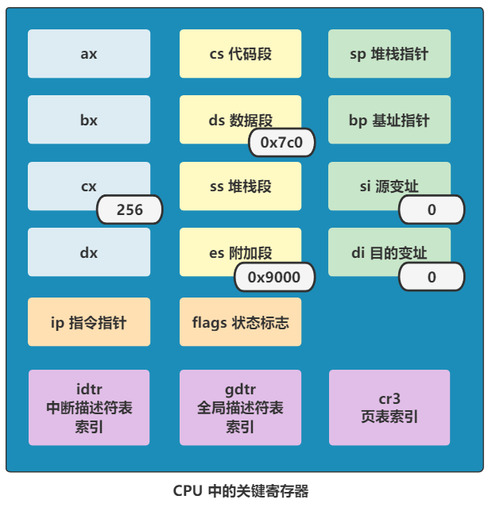

# 复制启动代码

## 1. 设置寄存器

继续看 bootsec.s 下面的代码：

````assembly
.equ BOOTSEG 0x07c0
.equ INITSEF 0x9000
mov ax, BOOTSEG
mov ds, ax
mov ax, INITSEG
mov es, ax
mov cx, #256
sub si, si
sub di, di
rep movw
````

完成寄存器的设置：

- 将 ds 寄存器的值设置为 0x07c0；
- 将 es 寄存器的值设置为 0x9000；
- 将 cx 寄存器的值设置为 256；
- 将 si，di 寄存器的值设置为 0；

> ```assembly
> sub reg1, reg2
> ```
>
> 这是减法指令，表示  reg1 = reg1 - reg2，所以若干 reg1 是 reg2，那么含义就是把这个寄存器清零；

现在 CPU 中寄存器的值是这样：




## 2. 复制启动代码至 0x90000

这些寄存器的设置都是为了执行最后一步：

````assembly
rep movw
````

`rep` 是重复执行指令，`movw` 表示要复制一个字（word 16位），意思是不断重复得复制一个字；

- 其中重复执行的次数是 cx 寄存器中的值，即为 256 此；
- 数据从 ds:si 处复制到 es:di 处，
    - ds:si 为 0x07c0 << 4 + 0 = 0x7c00；
    - es:di 为 0x9000 << 4 + 0 = 0x90000 
- 一次复制一个字，此两个字节；

意思就是：将内存地址为 0x7c00 处开始的 2 * 256 = 512 字节的数据复制到 0x90000 处；完成后内存布局为：


## 3. 跳转至 0x90000 执行启动代码

再往后是跳转指令：

````assembly
jmpi go, 0x9000
go:
	mov ax, cs
	mov ds, ax
````

jmpi 是段间接跳转指令，表示跳转到 0x9000:go 处执行，即为 0x90000 + go 处；

而 go 是一个标签，最终编译成机器码时会被翻译成一个值，这个值就时 go 标签所在的文件内的偏移地址；（可以理解为 go 是一个函数）

所以 0x90000 + go 就得到了 go 标签后的代码所在的内存地址，因为此时 bootsec 程序已经被复制到 0x90000 处了；


