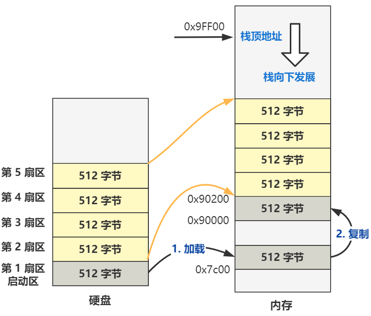

# 加载其他内核代码

CPU 继续执行启动程序：

````assembly
load_setup:
	mov dx, #0x0000
	mov cd, #0x0002
	mov bx, #0x0200
	mov ax, #0x0200+4
	int 0x13
	jnc ok_load_setup
	mov dx, #0x0000
	mov ax, #0x0000
	int 0x13
	jmp load_setup
	
ok_load_setup:
	...
````


## 1. 调用 BIOS 中断复制启动代码

**int** 指令，发起中断指令，`int 0x13` 表示发起 0x13 号中断，而之前的给 dx，cx、bx、ax 赋值都是作为中断程序的参数；

执行 `int 0x13` 后 CPU 会根据中断号 0x13 去寻找对于中断处理程序的入口地址，并跳转过去执行，相当于执行了一个函数。0x13 号中断处理程序是 BIOS 已经写好的读取磁盘的相关功能函数；

执行完毕后，BIOS 出手帮助操作系统将硬盘的第 2 个扇区开始，把数据加载到 0x90200 处，共 4 个扇区，每个扇区 512 字节：



刚好，把这四个扇区复制到启动程序的后面；

若干执行成功，跳转到 `ok_load_setup` 标签，如果失败，就不断重复这段代码；


## 2. 移动 system 区代码

接下来继续执行 ok_load_setup：

````assembly
ok_load_setup:
    ...
    mov ax,#0x1000
    mov es,ax       ; segment of 0x10000
    call read_it
    ...
    jmpi 0,0x9020
````

这段代码省略了很多非主逻辑的代码，重要的代码就是这些，作用是把从硬盘第 6 个扇区开始往后的 240 个扇区，加载到内存中的 0x10000 处；现在内存为：


现在操作系统的全部代码已经加载到内存中；

最后执行 `jmpi 0, 0x9020`，既跳转到内存 0x90200 处，这个位置就是硬盘第二个扇区被复制到内存中的位置，既开始执行 setup 代码；

> 这里出现了 bootsect、setup、system，这三段代码是操作系统编译产生的：
>
> - 把 bootsect.s 编译成 bootsect 放在硬盘的 1 扇区；
> - 把 setup.s 编译成 setup 放在硬盘的 2~5 扇区；
> - 把剩下的全部代码（head.s 作为开头）编译成 system 放在硬盘的随后 240 个扇区；
>
> 