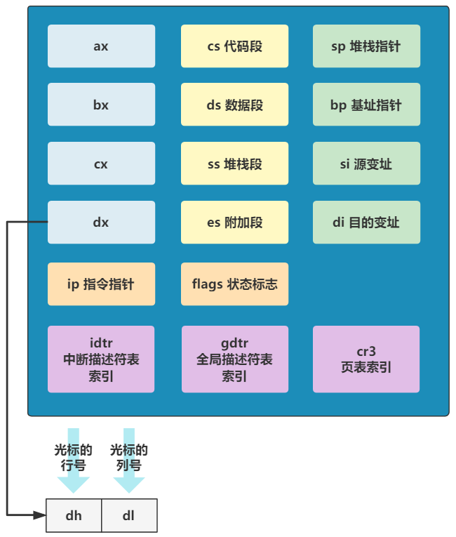

# 这边进入保护模式

bootsect 已经完成了任务，接下来需要进入 setup 程序：

````assembly
start:
	mov ax, #0x9000
	mov ds, ax
	mov ah, #0x03
	xor bh, bh
	int 0x10
	mov [0], dx
````

## 1. 执行 BIOS 中断

**int** 执行中断处理函数，`int 0x10` 表示 CPU 回跳转到 BIOS 提供的显示服务中断程序，而之前设置寄存器也是提供参数；

执行完毕后，dx 寄存器保存光标的位置，具体就是 dx 的高 8 位存储了行号，低 8 位存储了列号；



> 计算机在加电自检后会自动初始化到文字模式，在这种模式下，一屏幕可以显示 25 行，每行 80 个字符，也就是 80 列。

调用完后，执行 `mov [0], dx`，把光标位置保存再 [0] 处，这是一个内存地址，需要使用基地址：[0] --> 0x90000 + 0 = 0x90000；

这段代码就相当于：填入参数、执行函数、保存返回结果；

## 2. 配置信息至寄存器

继续执行：

````assembly
获取内存信息。
; Get memory size (extended mem, kB)
    mov ah,#0x88
    int 0x15
    mov [2],ax
获取显卡显示模式。
; Get video-card data:
    mov ah,#0x0f
    int 0x10
    mov [4],bx      ; bh = display page
    mov [6],ax      ; al = video mode, ah = window width
检查显示方式并取参数
; check for EGA/VGA and some config parameters
    mov ah,#0x12
    mov bl,#0x10
    int 0x10
    mov [8],ax
    mov [10],bx
    mov [12],cx
获取第一块硬盘的信息。
; Get hd0 data
    mov ax,#0x0000
    mov ds,ax
    lds si,[4*0x41]
    mov ax,#INITSEG
    mov es,ax
    mov di,#0x0080
    mov cx,#0x10
    rep
    movsb
获取第二块硬盘的信息。
; Get hd1 data
    mov ax,#0x0000
    mov ds,ax
    lds si,[4*0x46]
    mov ax,#INITSEG
    mov es,ax
    mov di,#0x0090
    mov cx,#0x10
    rep
    movsb
````

以上的代码原理都是一样的；

执行完毕后，将一些信息存储在内存中，之后会使用：

| 内存地址 | 长度 | 名称         |
| -------- | ---- | ------------ |
| 0x90000  | 2    | 光标位置     |
| 0x90002  | 2    | 拓展内存页数 |
| 0x90004  | 2    | 显示页面     |
| 0x90006  | 1    | 显示模式     |
| 0x90007  | 1    | 字符列数     |
| 0x90008  | 2    | 未知         |
| 0x9000A  | 1    | 显示内存     |
| 0x9000B  | 1    | 显示状态     |
| 0x9000C  | 2    | 显卡特性参数 |
| 0x9000E  | 1    | 屏幕行数     |
| 0x9000F  | 1    | 屏幕列数     |
| 0x90080  | 16   | 硬盘1参数表  |
| 0x90090  | 16   | 硬件2参数表  |
| 0x901FC  | 2    | 根设备号     |

完成这些操作之后。就规定好了一些内存地址，之后需要编译器在链接时做一些额外的工作，我往这里存，你从这里取，即可；

## 3. 关闭中断

继续：

````assembly
cli
````

这条指令的意思是关闭中断。现在系统中还保存着 BIOS 提供的中断向量表，之后我们需要将其破坏，写上操作系统提供的中断向量表，这个过程不允许中断；

## 4. 转移 system 代码至 0 处

继续：

````assembly
; first we move the system to it's rightful place
    mov ax,#0x0000
    cld         ; 'direction'=0, movs moves forward
do_move:
    mov es,ax       ; destination segment
    add ax,#0x1000
    cmp ax,#0x9000
    jz  end_move
    mov ds,ax       ; source segment
    sub di,di
    sub si,si
    mov cx,#0x8000
    rep movsw
    jmp do_move
; then we load the segment descriptors
end_move:
    ...
````

其中再次出现了 `rep movsw` 指令，上次使用是将启动代码从 0x7c00 移动到 0x90000 使用的，这里还是这个作用，将 0x10000 到 0x90000 的内容复制到 内存 0 的位置：

.png)


# 回顾

现在来梳理一下，我们已经执行完了 bootsect 的代码（灰色部分），现在正在执行 setup（黄色部分），其先在 0x90000 处规定了一些地址用来使用，把 0x90000 上的启动代码覆盖（反正这个代码已经执行完毕了），再把 0x10000 到 0x9000 这个部分的数据全部复制到 0 上，这段代码中保存着 system （蓝色部分）的代码，执行后，会把 0x7c00 处了启动代码覆盖；

最后内存布局为：

.png)

启动代码已经从内存中脱离，接下来需要完成 setup 中的模式转换部分，将此时的 16 位实模转变位 32 位的保护模式；