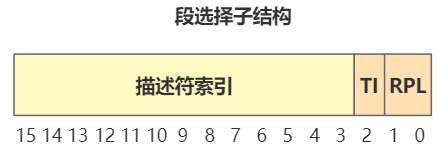

# 创建 gdt 与 idt

继续看 setup.s 的代码：

````assembly
lidt  idt_48      ; load idt with 0,0
lgdt  gdt_48      ; load gdt with whatever appropriate
````

## 实模式与保护模式

看分析代码之前，先说明一下实模式与保护模式的区别：

现在 CPU 还是处于实模式，计算内存地址的方式需要加上段寄存器 ds << 4 ：

.png)

而当 CPU 切换值保护模式，计算地址的方式更加复杂；

在实模式下 ds 寄存器的值称为段基址，保护模式下称为段选择子。段选择子的内存布局为：


其中的 3 - 15 bits 保存**段描述符**的索引。

意思就是，有一个保存若干个**段描述符**这种数据结构的数组，通过这个索引就可以定位到其中的一个**段描述符**：

.png)

得到了一个**段描述符**后，取出其中的段基地址，加上偏移地址，得到了物理地址；

整个过程如下:

.png)

## 全局描述符 gdt

现在的问题是，这个数组保存在哪里？如何被创建？这就是一开始给出的代码要处理的任务之一；

这个数组称为**全局描述符 gdt**，其保存在 setup 的内存中，其起始地址将被操作系统保存在 CPU 中的 gdtr 寄存器中：

.png)

保存的方式就是执行 lgdt 语句，这个语句的作用就是把后面的值保存到 gdtr 寄存器中：

````assembly
lgdt    gdt_48
````

而 gdt_48 是一个标签：

````assembly
gdt_48:
    .word   0x800       ; gdt limit=2048, 256 GDT entries
    .word   512+gdt,0x9 ; gdt base = 0X9xxxx
````

根据源码：gdt_48 是一个 48 位的数据，高 32 位保存全局描述表 gdt 的内存地址： 0x90200 + gdt；

而 gdt 也是一个标签，表示在文本中的偏移量，而这个文件是 setup.s，编译后放置在 0x90200 这个内存地址，这就是为什么 gdt 的地址要加上 0x90200；

那么现在去看 gdt，这里保存了全局描述符表在内存中的数据：

````assembly
gdt:
    .word   0,0,0,0     ; dummy

    .word   0x07FF      ; 8Mb - limit=2047 (2048*4096=8Mb)
    .word   0x0000      ; base address=0
    .word   0x9A00      ; code read/exec
    .word   0x00C0      ; granularity=4096, 386

    .word   0x07FF      ; 8Mb - limit=2047 (2048*4096=8Mb)
    .word   0x0000      ; base address=0
    .word   0x9200      ; data read/write
    .word   0x00C0      ; granularity=4096, 386
````

这里再附上段描述符结构，对应源码分析：
-16606279104171.png)

可以看到 gdt 目前有三个段描述符：

- 第一个为空；
- 第二个是**代码段描述符**（type = code），基地址为 0；
- 第三个是**数据段描述符**（type = data），基地址为 0；

所以暂时，我们进行地址转换时，通过段选择子（ds 中的索引）查找到的无论是代码段还是数据段，取出的基地址都是 0，物理地址等于逻辑地址；

.png)

得到了这样一个内存布局：

.png)

CPU 中的 gdtr 保存 gdt 的首地址，需要地址转换时，根据这个数组地址加上 ds 中的索引得到一个段描述符，再从中取出段基地址与逻辑地址相加得到物理地址；

不过此时 gdt 就两个段描述符，一个数据段一个代码段，它们的基地址都是 0；

这里还画出了 idtr 寄存器指向 idt，idt 是中断向量表，是之后就会构建出来的，也就是 `lidt  idt_48 ` 所做的工作；
