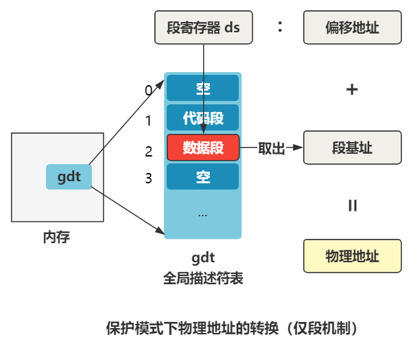

# 分页与分段

## 分页机制

再次设置好 gdt 与 idt 后，需要开启分页，看来看看分页机制：

目前 CPU 支持保护模式下的分段机制，计算物理地址的过程为：


当开启分页机制后，地址的转换又会多一个步骤。逻辑地址首先通过分段机制转换为**线性地址**，再通过依次分页机制的转换后才得到物理地址；

对一个 32 为的线性地址（已经经过分段机制），将其分为三个部分：

- 0-11 位：页内偏移；
- 12-21 位：页表索引；
- 22-31 位：页目录索引；

开启分页后，内存中存放一张**页目录表**，一个页目录项保存一个**页表地址**，每个**页表**又保存若干个**页面**的首地址，而内存都组织为一个个的页面，一个页面通常位 4KB；

1. 先通过**页目录索引**得到一个**页表地址**；
2. 用这个地址去找到一个**页表**
3. 通过**页表索引**在页表中得到一个页面的首地址；
4. 将页面首地址加上页内偏移得到最后的物理地址；

以线性地址 15M 为例子：


这些操作都由一个名为 MMU 的硬件完成（内存管理单元）；

转换的过程操作系统不需要管，只要把**页目录表**与**页表**配置好即可，这种分页方式称为二级页表，第一级页表为 PDE，第二季为 PTE，结构如下：

.png)


## 开启分页

了解了分页机制后，继续看是如何开启分页的：

由 setup_paging 开启：

````assembly
setup_paging:
    mov ecx,1024*5
    xor eax,eax
    xor edi,edi
    pushf
    cld
    rep stosd
    mov eax,_pg_dir
    mov [eax],pg0+7
    mov [eax+4],pg1+7
    mov [eax+8],pg2+7
    mov [eax+12],pg3+7
    mov edi,pg3+4092
    mov eax,00fff007h
    std
L3: stosd
    sub eax,00001000h
    jge L3
    popf
    xor eax,eax
    mov cr3,eax
    mov eax,cr0
    or  eax,80000000h
    mov cr0,eax
    ret
````

### 1. 设置 cr0 寄存器开启分页

之前开启保护模式的时候，仅仅是改变了 cr0 寄存器的一个 bit，现在开启分页模式页只是设置了 cr0 寄存器的 31 位：

.png)

开启之后 MMU 就可以帮助操作系统完成分页的转换；

上面这些代码先在内存中写好了页目录表与页表，最后开启 cro 寄存器的开关；

其中页目录表最多有 1024 个页目录项（1024个页表），1 个页表最多包含 1024 个页表项（1024 个页面），1 个页面是 2KB（对应偏移地址 12 位）；

### 2. 创建页目录表与页表

而上述代码将页目录表放置在 _pg_dir 标签；

````assembly
_pg_dir:
_startup_32:
    mov eax,0x10
    mov ds,ax
    ...
````

并且在其中放置四个页表地址，代码中也有 4 个页表的标签项：

````assembly
.org 0x1000 pg0:
.org 0x2000 pg1:
.org 0x3000 pg2:
.org 0x4000 pg3:
.org 0x5000
````

最后将页目录表和页表填好数据。随后开启分页机制，此时内存中的页表相关的布局为：


这些页目录表和页表放到了整个内存布局中最开头的位置，就是覆盖了开头的 system 代码了，不过被覆盖的 system 代码已经执行过了，所以无所谓；

同时，如 idt 和 gdt 一样，需要通过一个寄存器告诉 CPU 这些页表放在了哪里，就是这段代码：

````assembly
xor eax,eax
mov cr3,eax
````

这就是告诉 cr3 寄存器，0 地址处就是页目录表，再通过页目录表可以找到所有的页表，也就相当于 CPU 知道了分页机制的全貌了；

至此，内存布局为：


### 3. 设置页面映射

配置好了页目录表与页表的位置后，开始设置内存的映射关系：

`````assembly
setup_paging:
    ...
    mov eax,_pg_dir
    mov [eax],pg0+7
    mov [eax+4],pg1+7
    mov [eax+8],pg2+7
    mov [eax+12],pg3+7
    mov edi,pg3+4092
    mov eax,00fff007h
    std
L3: stosd
    sub eax, 1000h
    jpe L3
    ...
`````

结合页目录新项与页表项的结构：

.png)

- 第一行：将 _pg_dir 也即页目录表的地址放入 eax 寄存器；
- 第二行：将 pg0 + 7 这个地址放入到地址为 eax 的内存里；
    - 地址为 eax 的内存就是**页目录表**的第 0 个表项；
    - pg0 代表了第 0 号页表的地址， + 7 是为了设置属性，7 为  0111，根据结构图，把 P、RW、US 设置为1，表示此页表中的页：页存在、用户可读写；
    - 那么这句话的意思就是把0号页表地址保存到**页目录表**的 0 个表项，并且设置了 0 号页表中的页面属性；
- 第三 到 第 五行：与第二行同理，分别将 1、2、3 号页表地址存放到页目录表的第 1、2、3 个表项中；
- 后面几行表示，填充 4 个页表的每一项，一共 **4\*1024=4096** 项，依次映射到内存的前 16MB 空间。

最后，将前 16M 线性地址恰好与前 16M 的物理地址空一一对应；

-16606442315842.png)

