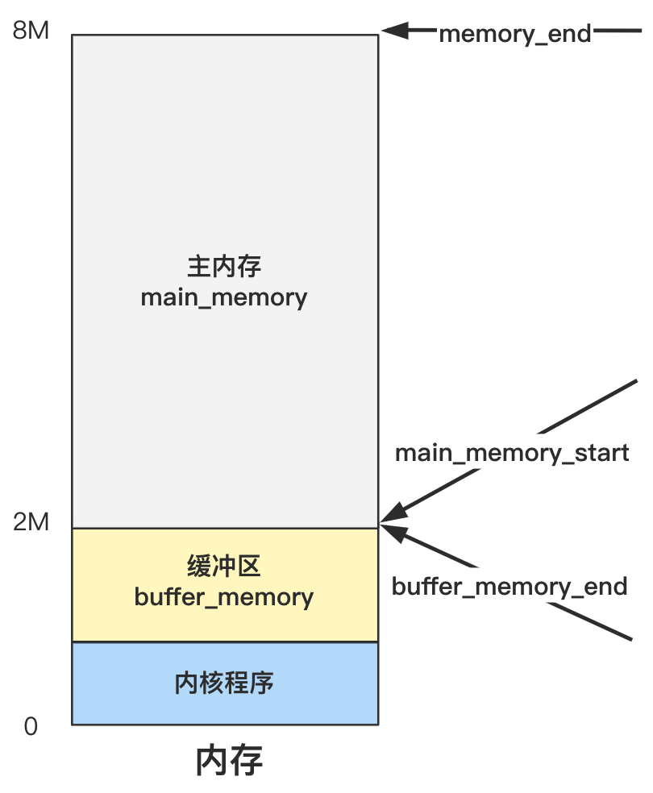

# 划定内存边界

执行 `main` 函数中的第一部分；


## 1. 获取根文件设备号

````c
ROOT_DEV = ORIG_ROOT_DEV;
drive_info = DRIVE_INFO;
````

其中 `ROOT_DEV` 是系统的根文件设备号，`drive_info` 为之前 setup 程序获取并且存储在 0x90000 处的设备信息，暂时不深究；


## 2. 计算三个边界值

继续执行：

```c
memory_end = (1<<20) + (EXT_MEM_K<<10);
memory_end &= 0xfffff000;
if (memory_end > 16*1024*1024)
    memory_end = 16*1024*1024;
if (memory_end > 12*1024*1024) 
    buffer_memory_end = 4*1024*1024;
else if (memory_end > 6*1024*1024)
    buffer_memory_end = 2*1024*1024;
else
    buffer_memory_end = 1*1024*1024;
main_memory_start = buffer_memory_end;
```

上面的代码计算出了三个值：

- `main_memory_start`
- `memory_end`
- `buffer_memory_end`

并且最后一行： `main_memory_start = buffer_memory_end;` 所以其实只算了两个值；

`if else`  的作用就是针对不同的内存大小，设置不同的边界值；

总之最后，三个值指向了内存中的几个位置：



三个变量划定了内存的边界；

而具体主内存与缓冲区如何管理与分配，就要看第二部分的内容了；