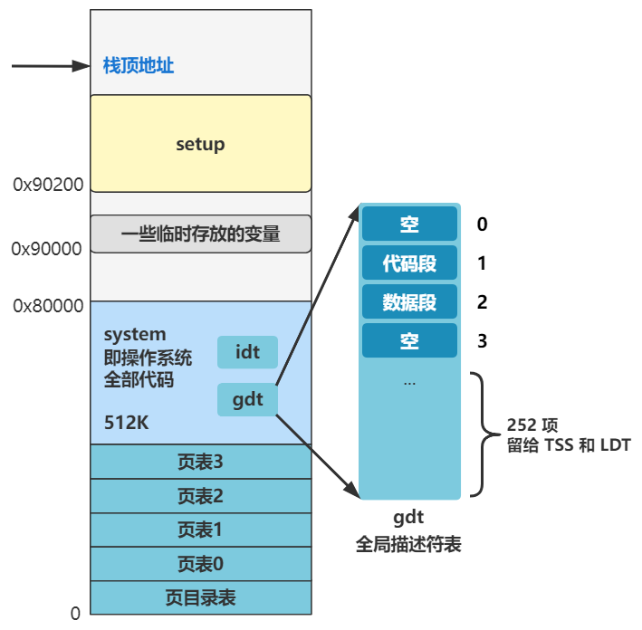

# 执行 `shed_init`

完成 `time_init()` 后，进入进程调度的初始化函数 `shed_init()`：

````c
void main(void) {
    ...
    mem_init(main_memory_start,memory_end);
    trap_init();
    blk_dev_init();
    chr_dev_init();
    tty_init();
    time_init();
    sched_init();
    buffer_init(buffer_memory_end);
    hd_init();
    floppy_init();
    
    sti();
    move_to_user_mode();
    if (!fork()) {init();}
    for(;;) pause();
}
````

打开函数：

```c
void sched_init(void) {
    set_tss_desc(gdt+4, &(init_task.task.tss));
    set_ldt_desc(gdt+5, &(init_task.task.ldt));
    ...
}
```

## 1. 初始化 TTS 与 LDT

首先两行代码初始化了 **TSS** 与 **LDT**，之前创建全局描述表时就预留了空间给它们



这两行代码就是往 gdt 后再加两个表项： **TSS**  与 **LDT**（放进入的也是指针，指向两个数据结构）

-16607154412632.png)

- **TSS**：任务状态段，保存和恢复进程的上下文，保存进程的各个寄存器信息，这样切换进程时，才可以保存和恢复上下文，继续执行，每个进程都需要拥有一个独立的 tss_struct 结构体：

    ````c
    struct tss_struct{
        long back_link;
        long esp0;
        long ss0;
        long esp1;
        long ss1;
        long esp2;
        long ss2;
        long cr3;
        long eip;
        long eflags;
        long eax, ecx, edx, ebx;
        long esp;
        long ebp;
        long esi;
        long edi;
        long es;
        long cs;
        long ss;
        long ds;
        long fs;
        long gs;
        long ldt;
        long trace_bitmap;
        struct i387_struct i387;
    };
    ````

- **LDT**：局部描述表，是与 gdt 相对应的，内核态的代码用 gdt 里面的数据段与代码段描述符，而每个用户进程都拥有字节的 LDT 来获取数据段、代码段描述符；

    之后有多个用户进程时，gdt 会变成这样：

    .png)

## 2. 赋值 `tsak` 与 `gdt` 

添加完 TTS 与 LDT 后，继续执行：

````c
struct desc_struct {
    unsigned long a,b;
}

struct task_struct * task[64] = {&(init_task.task), };

void sched_init(void) {
    ...
    int i;
    struct desc_struct * p;
        p = gdt+6;
    for(i=1;i<64;i++) {
        task[i] = NULL;
        p->a=p->b=0;
        p++;
        p->a=p->b=0;
        p++;
    }
    ...
}
````

首先可以看到，存在一个 `task_struct*` 结构体数组 `task`；

在 `shed_init` 函数中执行一个循环，完成以下两件事：

### 赋值 `task` 数组

将数组 `task` 的 0 - 63 赋值为 NULL；

.png)

`task_struct` 结构体就代表一个进程的信息：

````c
struct task_struct {
/* these are hardcoded - don't touch */
    long state; /* -1 unrunnable, 0 runnable, >0 stopped */
    long counter;
    long priority;
    long signal;
    struct sigaction sigaction[32];
    long blocked; /* bitmap of masked signals */
  /* various fields */
    int exit_code;
    unsigned long start_code,end_code,end_data,brk,start_stack;
    long pid,father,pgrp,session,leader;
    unsigned short uid,euid,suid;
    unsigned short gid,egid,sgid;
    long alarm;
    long utime,stime,cutime,cstime,start_time;
    unsigned short used_math;
  /* file system info */
    int tty;  /* -1 if no tty, so it must be signed */
    unsigned short umask;
    struct m_inode * pwd;
    struct m_inode * root;
    struct m_inode * executable;
    unsigned long close_on_exec;
    struct file * filp[NR_OPEN];
  /* ldt for this task 0 - zero 1 - cs 2 - ds&ss */
    struct desc_struct ldt[3];
  /* tss for this task */
    struct tss_struct tss;
};
````

### 赋值 `gdt` 剩余表项

给 gdt 的剩下的位置填充上 0，即把剩下留给其他进程的 TSS 和 LDT 都先附上空值：

.png)

之后每创建一个进程，就会在后面添加一组 TSS 和 LDT 表示这个进程的任务状态段和局部描述符信息；就像之前的图片展示的：

.png)

现在已经加入了一组 TSS 和 LDT，那是因为现在正在执行的 main 函数，在进程调度机制创建完成后，就会称为 0 号进程，这里的 TSS 和 LDT 就是给  0 号进程使用的；

## 3. 记录 `TSS` 与 `LDT` 位置

继续执行程序：

````c
#define ltr(n) __asm__("ltr %%ax"::"a" (_TSS(n)))
#define lldt(n) __asm__("lldt %%ax"::"a" (_LDT(n)))

void sched_init(void) {
    ...
    ltr(0);
    lldt(0);
    ...
}
````

这里的 `ltr(0)` 与 `lldt(0)`  的作用类似于之前的汇编指令 `lidt` 和 `lgdt`，`lidt` 告诉 CPU 中断描述符表 idt 在内存中的位置，保存在 idtr 寄存器中；`lgdt` 告诉 CPU 全局描述表 gdt 在内存中的位置，保存在 gdtr 寄存器中；

而这两个函数：

- `ltr` 是给 tr 寄存器赋值，告诉 CPU 任务状态段 TSS 在内存中的位置；
- `lldt` 是给 ldt 寄存器赋值，告诉 CPU 局部描述符 LDT 在内存中的位置；
- 这里的参数 0，我认为是把 0 号进程的相关结构体放入 CPU 的寄存器中，因为只要有进程号，那么其在 gdt 中的位置是确定的；

（PS，再提一下，gdt 保存的只是很多结构体的地址，这些结构体都是很大的）

执行完毕后：

.png)

这样,CPU 之后就可以通过 tr 寄存器找到当前进程的任务状态段信息（上下文信息），通过 ldt 寄存器找到当前进程在用的局部描述符信息；

## 4. 开启计数器

继续执行：

````c
void sched_init(void) {
    ...
    outb_p(0x36,0x43);      /* binary, mode 3, LSB/MSB, ch 0 */
    outb_p(LATCH & 0xff , 0x40);    /* LSB */
    outb(LATCH >> 8 , 0x40);    /* MSB */
    set_intr_gate(0x20,&timer_interrupt);
    outb(inb_p(0x21)&~0x01,0x21);
    set_system_gate(0x80,&system_call);
    ...
}
````

- 四行读取端口（端口已经介绍过了），这次是跟一个可编程的定时器芯片交互。这四号代码开启定时器，之后这个定时器会持续地、以一定频率地向 CPU 发出中断信号，作为时间片到期的中断；
- 两行设置中断：
    - 一个中断号为 0x20 的时钟中断，处理程序为 `timer_interrupt`；每次计时器向 CPU 发送中断，就会执行这个函数；
    - 一个中断号为 0x80 的系统调用 `system_call`，这个是一个十分重要的中断，所有用户程序需要调用内核的函数，都需要经过这个中断来进行；


# 回顾

回顾一下已经配置好的中断：

| 中断号   | 中断处理函数         |
| -------- | -------------------- |
| 0 - 0x10 | trap_init 设置的一些 |
| 0x20     | timer_interrupt      |
| 0x21     | keyboard_interrupt   |
| 0x80     | system_call          |


