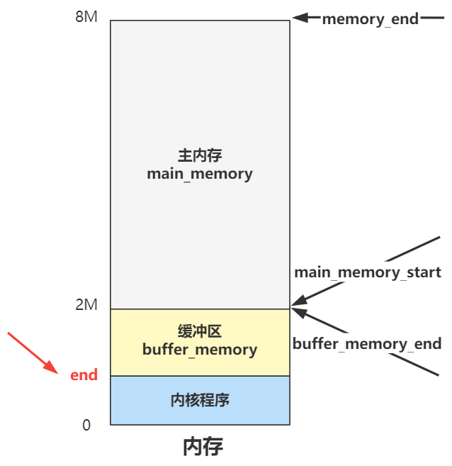

# 回顾

## 1. 划分内存边界

进入 main 函数后，首先进行了内存划分，设置了几个边界值，将内核程序、缓冲区、主内存三个部分划清界限：

## 2. 构建 `mem_map` 管理内存

随后，通过 mem_init 函数，对主内存区域使用 mem_map 数组管理起来；起始就是每个位置表示一个 4K 大小的内存页使用次数；

之后对主内存的申请和管理都是对 mem_map 数组的操作；

## 3. 组织缓冲区为环形链表

后面又通过 buffer_init 函数，对缓冲区区域多种数据结构管理起来。其中包括双向链表缓存头 h 和每个缓存头管理的 1024 字节大小的缓存块 b：

## 4. 构建缓冲区 `hash_table` 方便查找

同时，又使用一个 hashmap 结构，索引到所有缓存头，方便快速查找，为之后的 LRU 算法使用缓冲区作准备；

这些结构，就是缓冲区部分的管理，而缓冲区的目的是为了加速磁盘的读写效率，后面将读写文件全流程的时候，会看到它在整个流程中起到中流砥柱的作用。

## 5. 配置默认中断

再往后， trap_init 函数把中断描述符的一些默认中断设置好，随后再由各个模块设置它们自己需要的个性化中断：

## 6. 初始化块设备请求数组 `request`

再之后，通过 blk_dev_init 对读写块设备（比如硬盘）的管理进行初始化，比如对硬盘的读写操作，都封装为一个 request 结构放在 request[] 数组中：

## 7. 赋值 `task` 数组

再往后，通过 tty_init 里的 con_init，实现了在控制台输出字符的功能，并且可以支持换行、滚屏等效果。当然此处也开启了键盘中断，如果此时中断已经处于打开状态，可以用键盘往屏幕上输出字符；

再之后，shed_init 函数，定义好了全部进程的管理结构 task 数组，并在索引 0 的位置赋值，作为 0 号进程的结构体：

## 8. 添加 TSS 与 LDT

然后又向 gdt 中加入 TSS 和 LDT，来管理 0 号进程的上下文信息和内存规划：

## 9. 保存 TSS 与 LDT 位置

同时，将这两个结构的地址，告诉 tr 寄存器和 ldt 寄存器，让 CPU 能够找到它们：

## 10. 开启计时器与时钟中断

随后，开启定时器，以及设置了时钟中断，用于响应定时器每隔 100ms 发来的中断信号

最后最后，一个简单的硬盘初始化 hd_init，为我们开启了硬盘中断，并设置了硬盘中断处理函数，此时便可以真正通过硬盘的端口与其进行读写交互了；

主要的任务就是配置系统中的各种数据结构，并且为 0 号进程的独立打基础，开启了时钟中断；

# 中断表

把之前几个模块设置的中断放一块，此时的中断表：

| 中断号   | 中断处理函数               |
| -------- | -------------------------- |
| 0 - 0x10 | trap_init 中设置的一些函数 |
| 0x20     | timer_interrupt            |
| 0x21     | keyboard_interrupt         |
| 0x2E     | hd_initerrupt              |
| 0x80     | system_call                |

# 补充其他 `init` 函数

这些 init 中有些没有提到：

`chr_dev_int` --> 空函数；

`tty_init` 里面的 `rs_init`，串口中断的开启，因为串口已经很少见，忽略；

`floppy_init`，这个是软盘的初始化，软盘现在已经被淘汰了，且电脑上也没有软盘控制器了，所以也忽略即可；