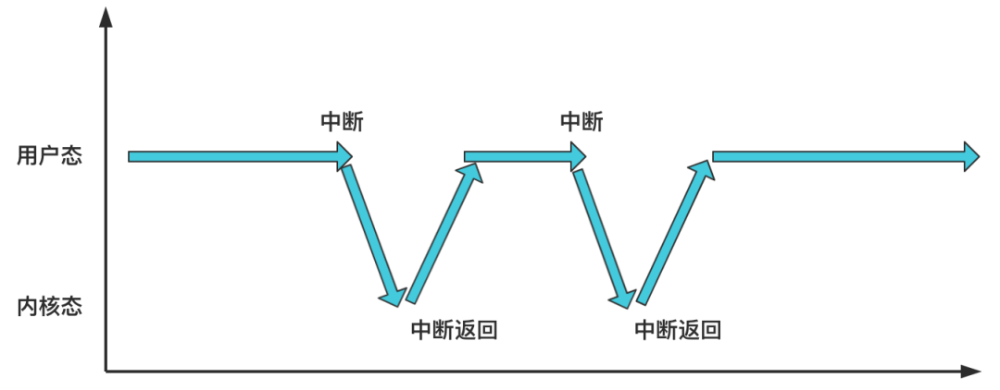

至此完成了各个初始化工作，接下来需要创建新的进程：

````c
void main(void) {
    // 第二部分的内容，各种初始化工作
    ...
    // 第三部分的内容，一个新进程的诞生
    move_to_user_mode();
    if (!fork()) {
        // 新进程里干了啥，是第四部分的内容
        init();
    }
    // 死循环，操作系统怠速状态
    for(;;) pause();
}
````

首先总览这四行代码：

# 总览代码

## 1. 转为用户态

第一行：`move_to_user_mode`；

<u>**转变为用户态模式**</u>。Linux 将操作系统特权级别分为**用户态**和**内核态**两种，之前的都是处于内核态，之后要转为用户态；

执行完后，就会一直处于用户态，除非发生了**中断**，比如执行系统调用，此时用户态陷入内核态，当执行完毕后，又回到用户态；




## 2. 执行 `fork`

`fork()` 函数用于<u>**创建一个新的进程**</u>；

之前的系统中只有一个执行流，即 0 号进程，调用完 `fork` 后，系统中会多出一个 1 号进程；

之后当时钟信号来临时，两个进程就会开始根据调度算法进行切换；


## 3. 执行 `init`

`fork()` 创建得到的新进程是于执行 `fork()` 的进程拥有一样的代码，并且 `fork` 会在两个进程中返回不同的结果，所以在这里：

````c
if (!fork()) {
    init();
}
````

只有子进程返回 0，所以只有<u>**子进程进入这个函数执行 `init()`；**</u>

这个函数会再去创建另一个新进程，2 号进程，在这个进程中<u>**加载于用户交互的 shell 程序；**</u>


## 4. 执行`pause`

执行完前面的代码后，0 号进程与 1 号进程的任务完成，<u>**阻塞在 `pause()`；**</u>


