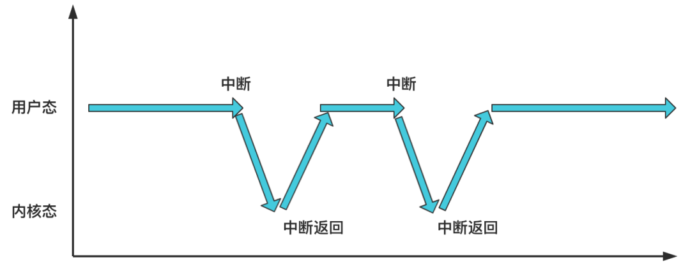

首先执行 ：

````c
move_to_user_mode()
````

执行后，从内核态转为了用户态；

# 从内核态到用户态

## 特权级

用户进程都在用户态这个特权级下运行，而有时程序想要做一些内核态才允许做的事情，比如读取硬盘的数据，就需要通过系统调用，来请求操作系统在内核态特权级下执行一些指令；

而用户态与内核态的本质就是 **特权级**：

这一切都源于 CPU 的保护机制。CPU 为了配合操作系统完成保护机制，设计处了分段与分页保护机制；

将 cr0 寄存器的 PE 为开启，即为开启保护模式——分段保护机制：

.png)

将 cr0 寄存器的 PG 为开启，即为开启分页模式——分页保护机制：

.png)

所以现在获得吓一条执行代码的内存地址，需要使用到 CPU 的两个寄存器 cs:eip，cs 是代码段寄存器，里面保证着选择子：

.png)

其中的低两位此时表示 CPL，也就是**当前所处的特权级**，假如此时 cs 寄存器的后两位是 3，二进制 11，那么就表示当前处理器处于用户态这个特权级；

此时如果我们需要跳转到另一个内存地址执行，会需要使用 `jmp`、`call` 和中断这些方式；

如果是短跳转： `jmp xxx`，那么不涉及段的变换，也不需要作特权级检查；

如果是长跳转：`jmp yyy:xxx`，这里的 yyy 就是另一个要跳转到的段的段选择子结构：

-16607847474321.png)

而作为跳转目标，此时后两位表示的是 RPL，即**请求特权级**，表示想要请求的特权级是声明；同时，CPU 会拿到这个段选择子去全局描述符表 gdt 中寻找段描述符，从中找到段基地：
.png)

段描述符的结构：

.png)

可以看到，其中存在一个 DPL，表示**目标代码段特权级**，也就是即将跳转过去的那个段的实际特权级；

总结一下：

.png)

- CPU 中的 cs 寄存器保存着当前处理器特权级；
- `jmp yyy:xxx` 中的 yyy 表示现在希望请求的段的特权级；
- 取出 yyy 中的索引到 gdt 寻找，对应的段描述符保存这个段真实的特权级；

当跳转发生，CPU 会去检查这些值，通常情况下要求：CPL 必须等于 DPL，才会跳转成功；

即：当前处理器的特权级，必须等于要跳转过去的代码所处的段的特权级：只能从用户态跳转到用户态，内核态跳转到内核态；

这样就防止了用户态程序，进入内核，破坏内核；

这只是代码段跳转时所做的特权级检查，还有访问**内存数据**时也会有数据段的特权级检查，这里就不展开

总之，配合上段描述符与特权级检查，效果是，**处于内核态的代码可以访问任何特权级的数据段，处于用户态的代码则只可以访问用户态的数据段**，这也就实现了内存数据读写的保护；

---


## 切换特权级——模拟中断返回

这就是这行代码需要解决的问题，

````c
move_to_user_mode()
````

Intel 设计了很多特权级转换的方式，**中断**和**中断返回**就是其中一种；

**处于用户态的程序，通过触发中断，可以进入内核态，之后再通过中断返回，又可以恢复为用户态**；



而一个系统调用，就是通过执行 `int 0x80` 中断指令除法中断，CPU 会切换到内核态，执行中断处理程序，之后中断返回，回到用户态；

所以这函数就是执行了一个中断返回：

````c
void main(void) {
    ...    
    move_to_user_mode();
    ...
}

#define move_to_user_mode() \
_asm { \
    _asm mov eax,esp \
    _asm push 00000017h \
    _asm push eax \
    _asm pushfd \
    _asm push 0000000fh \
    _asm push offset l1 \
    _asm iretd /* 执行中断返回指令*/ \
_asm l1: mov eax,17h \
    _asm mov ds,ax \
    _asm mov es,ax \
    _asm mov fs,ax \
    _asm mov gs,ax \
}
````

`iretd` 执行中断返回；

而之前的五次压栈动作，其实就模拟发生了中断；

一般情况下，中断与中断返回应该是联用的，中断发生时，CPU 会将一些必要的数据压入栈中；而中断返回时，CPU 又会把压入栈中的返回值赋值寄存器；

.png)

就像执行一个函数需要把原栈顶、程序计数器等压入栈中一样，如上图，如果不记错误码，有五个值会被压入栈中：

- SS：中断发生之前的段栈段；
- ESP：中断发生前的栈顶指针；
- EFLAGS：标志寄存器；
- CS：中断发生前的代码段；
- EIP：中断发生前的指令寄存器；

压入后，去执行中断程序，那么当中断返回时，这些值又会被 CPU 从内存取出，赋值给对应寄存器，恢复原来的执行状态；

这里在执行中断返回前，也压入了五个寄存器，并且在压入后直接返回，假装发生了一次中断，并且从中断返回，其中：

- 压入栈的 CS 和 EIP 就表示中断发生前代码所处的位置，这样中断返回后好继续去那里执行；
- 压入栈的 SS 和 ESP 表示中断发生前的栈的位置，这样中断返回后才好恢复原来的栈；

而特权级的转换就体现在两个段寄存器 CS 与 SS 中：

-16607864719322.png)

对应源码：

````c
#define move_to_user_mode() \
_asm { \
    _asm mov eax,esp \
    _asm push 00000017h \ ; 给 SS 赋值
    _asm push eax \
    _asm pushfd \
    _asm push 0000000fh \ ; 给 CS 赋值
    _asm push offset l1 \
    _asm iretd /* 执行中断返回指令*/ \
_asm l1: mov eax,17h \
    _asm mov ds,ax \
    _asm mov es,ax \
    _asm mov fs,ax \
    _asm mov gs,ax \
}
````

以 CS 为例子，将 00000fh 压入 CS 寄存器对应的位置，中断返回后，CS 的值称为 0000fh --> 0000 0000 0000 1111；

最后两位为 11，表示用户态，而 CS 寄存器中的特权级就代表这当前处理器的特权级别 CPL；

-16607864719322.png)

除了修改特权级，CS 此时为 0000 0000 0000 1111，倒数第三位的 TI 为 1，这表示 CS 寄存器中 3 - 15 位的描述符索引，是从 GDT 还是从 LDT 中取得，1 表示 LDT，也就是说到局部描述符表取；

.png)

而从 LDT 中的索引去取，而此时 CS 的描述符索引为 1，那么就是 LDT 的第 1 号，这个 LDT 恰好属于第 1 号进程；

---

那么继续看源码：

````c
void main(void) {
    ...    
    move_to_user_mode();
    ...
}

#define move_to_user_mode() \
_asm { \
    _asm mov eax,esp \
    _asm push 00000017h \
    _asm push eax \
    _asm pushfd \
    _asm push 0000000fh \
    _asm push offset l1 \
    _asm iretd /* 执行中断返回指令*/ \
_asm l1: mov eax,17h \
    _asm mov ds,ax \
    _asm mov es,ax \
    _asm mov fs,ax \
    _asm mov gs,ax \
}
````

给程序计数器赋值为 l1，而 l1 就是接下来的程序，所以在中断返回后，CPU 继续去这个执行，看起来进行了一次中断返回，实际上就是属性执行；

