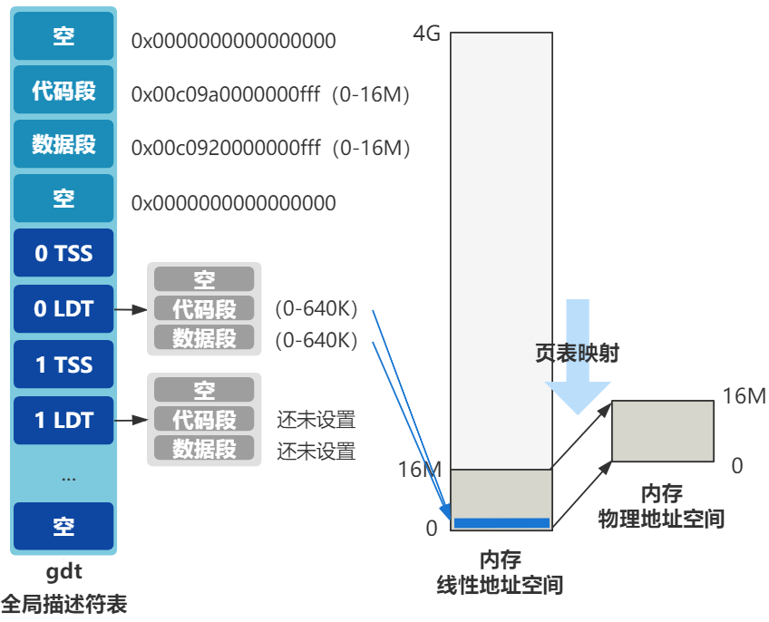

至此，进程 1 的 `task_struct` 被创建，并且附上了一些值，被保存在 tsak 数组的第一个位置；

接下来执行 `copy_mem`  的后半部分：

````c
int copy_process(int nr, ...) {
    ...
    copy_mem(nr,p);
    ...
}
````

# 调用：`copy_mem`

````c
int copy_mem(int nr,struct task_struct * p) {
    // 局部描述符表 LDT 赋值
    unsigned long old_data_base,new_data_base,data_limit;
    unsigned long old_code_base,new_code_base,code_limit;
    code_limit = get_limit(0x0f);
    data_limit = get_limit(0x17);
    new_code_base = nr * 0x4000000;
    new_data_base = nr * 0x4000000;
    set_base(p->ldt[1],new_code_base);
    set_base(p->ldt[2],new_data_base);
    // 拷贝页表
    old_code_base = get_base(current->ldt[1]);
    old_data_base = get_base(current->ldt[2]);
    copy_page_tables(old_data_base,new_data_base,data_limit);
    return 0;
}
````

主要是 LDT 表项的赋值，与页表的拷贝；

## LDT 表的赋值：

系统开启了分页，一共逻辑地址需要经过分段与分页机制才能得到物理地址；分页的转换为：

.png)

在之前已经配置好了进程 0 的页表，完成 0 号进程的线性地址空间的前 16M 与内存物理地址空间的前 16M 一一对应；

而对进程 1 还没有配置好页表，所以现在内存看起来是：



所以现在就需要去给 LDT 赋值，看代码：

### 设置段限长

先设置段限长，取自 0 号线程的，也就是 640K：

````c
int copy_mem(int nr,struct task_struct * p) {
    ...
    code_limit = get_limit(0x0f);
    data_limit = get_limit(0x17);
    ...
}
````

### 获取段基地址

而段基地址需要取决于当前的进程号

````c
int copy_mem(int nr,struct task_struct * p) {
    ...
    new_code_base = nr * 0x4000000;
    new_data_base = nr * 0x4000000;
    ...
}
````

0x4000000 等于 64M；

这是写死的数字，既之后的每个进程都在线性空间中占用 64M；

因为 Linux0.11 比较简单，每个进程的线性地址空间不会重复；

### 设置 LDT 表

最后把 LDT 设置到 LDT 表里：

````c
int copy_mem(int nr,struct task_struct * p) {
    ...
    set_base(p->ldt[1],new_code_base);
    set_base(p->ldt[2],new_data_base);
    ...
}
````

得到结果：

.png)

完成了 1 号进程 LDT 的管理；

## 页面的复制

继续 `copy_mem ` 的最后一行：

````c
int copy_mem(int nr,struct task_struct * p) {
    ...
    // old=0, new=64M, limit=640K
    copy_page_tables(old_data_base,new_data_base,data_limit)
}
````

原来进程 0 有**一个页目录表**和**四个页表**，将线性地址空间的 0-16M 原封不动映射到了物理地址空间的 0-16M：

.png)

所以 进程 1 也需要一套页表，来到 `copy_page_tables` 函数：

````c
/*
 *  Well, here is one of the most complicated functions in mm. It
 * copies a range of linerar addresses by copying only the pages.
 * Let's hope this is bug-free, 'cause this one I don't want to debug :-)
 */
int copy_page_tables(unsigned long from,unsigned long to,long size)
{
    unsigned long * from_page_table;
    unsigned long * to_page_table;
    unsigned long this_page;
    unsigned long * from_dir, * to_dir;
    unsigned long nr;

    from_dir = (unsigned long *) ((from>>20) & 0xffc);
    to_dir = (unsigned long *) ((to>>20) & 0xffc);
    size = ((unsigned) (size+0x3fffff)) >> 22;
    for( ; size-->0 ; from_dir++,to_dir++) {
        if (!(1 & *from_dir))
            continue;
        from_page_table = (unsigned long *) (0xfffff000 & *from_dir);
        to_page_table = (unsigned long *) get_free_page()
        *to_dir = ((unsigned long) to_page_table) | 7;
        nr = (from==0)?0xA0:1024;
        for ( ; nr-- > 0 ; from_page_table++,to_page_table++) {
            this_page = *from_page_table;
            if (!(1 & this_page))
                continue;
            this_page &= ~2;
            *to_page_table = this_page;
            if (this_page > LOW_MEM) {
                *from_page_table = this_page;
                this_page -= LOW_MEM;
                this_page >>= 12;
                mem_map[this_page]++;
            }
        }
    }
    invalidate();
    return 0;
}
````

其中附上了 Linus 本人的注释：

> "这部分是内存管理中最复杂的代码，希望这段代码没有错误（bug-free），因为我实在不想调试它！"

这个函数需要完成的是：创建进程 1 的页表，使得进程 1 和进程 0最终被映射到的物理地址空间为 0 - 64M：

.png)

总之，最后的效果是：

- 假设现在正在运行进程 0，代码中给出一个虚拟地址 0x03，由于进程 0 的 LDT 中代码段基址是 0，所以线性地址也是 0x03，最终由进程 0 页表映射到物理地址 0x03 处；
- 假设现在正在运行进程 1，代码中给出一个虚拟地址 0x03，由于进程 1 的 LDT 中代码段基址是 64M，所以线性地址是 64M + 3，最终由进程 1 页表映射到物理地址也同样是 0x03 处；

.png)

**即，进程 0 和进程 1 目前共同映射物理内存的前 640K 的空间**

就拿这个地址来举例：

对进程 1，64 M + 0x03 的线性地址为（64M = 2^26）：

0000010000 0000000000 000000000011；

对进程 0，0x03 的线性地址为

0000000000 0000000000 000000000011；

根据分页机制的转化规则，**前 10 位表示页目录项，中间 10 位表示页表项，后 12 位表页内偏移**：

进程 1 要找的是页目录项 16 中的第 0 号页表

进程 0 要找的是页目录项 0 中的第 0 号页表

那只要让这俩最终找到的两个页表里的数据一模一样即可；

具体如何实现，就是上面那个很复杂的函数了；

那么到这里，就把 1 号进程管理内存所需要的两个重要结构：LDT 与页表创建完成并且赋值！

---

拓展有关页表的内容：

.png)

其中 RW 位表示读写状态，0 表示只读（或可执行），1表示可读写（或可执行）。当然，在内核态也就是 0 特权级时，这个标志位是没用的

看下面的代码：

````c
int copy_page_tables(unsigned long from,unsigned long to,long size) {
    ...
    for( ; size-->0 ; from_dir++,to_dir++) {
        ...
        for ( ; nr-- > 0 ; from_page_table++,to_page_table++) {
            ...
            this_page &= ~2;
            ...
            if (this_page > LOW_MEM) {
                *from_page_table = this_page;
                ...
            }
        }
    }
    ...
}
````

~2 表示取反，2 用二进制表示是 10，取反就是 01，其目的是把 this_page 也就是当前的页表的 RW 位置零，也就是是**把该页变成只读**；

而 `*from_page_table = this_page` 表示**又把源页表也变成只读**

也就是说，经过 fork 创建出的新进程，其页表项都是只读的，而且导致源进程的页表项也变成了只读；

这个就是**写时复制**的基础，新老进程一开始共享同一个物理内存空间，如果只有读，那就相安无事，但如果任何一方有写操作，由于页面是只读的，将触发缺页中断，然后就会分配一块新的物理内存给产生写操作的那个进程，此时这一块内存就不再共享了；

> PS：对于 Linux0.11 中的页表拷贝：
>
> Linux0.11 是一个比较简单的操作系统，所以可以看到，每个进程只有 64M 的线性地址空间，并且所有进程的地址空间是**不会重复**的；
>
> 所以整个系统中最多就只要管理 4G 空间的线性地址对物理地址的映射关系（32位地址来表示线性地址空间，而所有进程的线性地址空间不可以重复）；
>
> 而一张页目录表最多有 1K 个页面，每个页表最多有 1K 个页面，所以一共可以表示 4G 的空间，刚好可以把整个线性地址空间全部包括；
>
> 那么<u>整个 Linux0.11 系统就只要一张页目录表</u>，实际上也就是这样做的，整个系统的页目录表放置在物理内存最开始的位置；
>
> 所以在 `copy_page_tables` 函数中，系统没有给新的进程申请一张页目录表，只是在创建了**一些页表**，然后根据进程线性地址空间的前十位，把这些**页表起始地址**放置到系统**页目录表**的对应表项中，这些页表在物理内存中的位置是由 mem_map 判断申请得到的；
>
> 在切换进程时，也不需要更改进程的页目录表，因为就一个，每个进程的线性地址空间不会重复，所以一个页目录表就足够（用线性地址的前 10 位确定页表）；
>
> 但对现代操作系统，操作系统给每个进程分配了整个线程地址空间，那么这个时候两个进程就会拿出两个完全一致的线性地址空间，所以每个进程都需要一张页目录表；

---


# 回顾：

至此，`frok()` 中的 `copy_process` 函数执行完毕：

## 1. 复制 task_struct

.png)

## 2. LDT 的复制和改造

LDT 的复制和改造，使得进程 0 和进程 1 分别映射到了不同的线性地址空间

.png)

## 3. 复制页表

页表的复制，使得进程 0 和进程 1 又从不同的线性地址空间，被映射到了相同的物理地址空间：

.png)

最后两个进程的页表都称为只读状态，为写时复制与缺页中断做准备；


