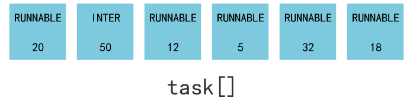
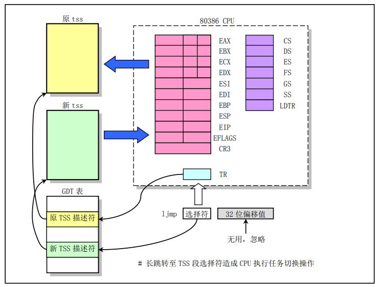

至此，系统中的 1 号进程被创建；

在这个部分中，前四回讲述了进程调度机制，又用后回内容讲述了 fork 函数的细节；


# 进程调度机制

进程调度的开始，是那个每 10 ms 触发一次的定时器；

这个计时器回给 CPU 产生一个时钟中断信号；

而这个中断信号会使 CPU 查找中断向量表，找到操作系统写好的一个时钟中断处理函数 `do_timer`；

`do_timer` 首先将进程的 `counter` 变量 -1，如果其仍大于 0，中断处理结束；

但如果其 = 0，就开始进程的调度；

进程调度就是找到处于 RUNNABLE 状态的进程，并找到一个 counter 最大的进程，把其丢入 switch_to 函数的入参：



switch_to 会保存当前进程上下文，恢复要跳转到的那个进程的上下文，同时使得 CPU 跳转到这个进程的偏移地址处；



接着，这个进程就运行起来了，等待下一个时钟中断的到来；


## fork

执行 `fork()` 的步骤：


其中，`copy_process` 是复制进程的关键，分三步：

1. 原封不动复制了 task_struct；

    
   
   并且覆盖了一些基本信息，包括元信息和一些寄存器的信息。其中比较重要的是将内核态堆栈栈顶指针的指向了自己进程结构所在 4K 内存页的最顶端；
   
   
   
2. LDT 的复制与改造，使得进程 0 和进程 1 分别映射到了不同的线性地址空间：

    

3. 页表的复制，使得进程 0 和进程 1 又从不同的线性地址空间，被映射到了相同的物理地址空间：

    

    最后把两个进程的页表都变成只读状态，为后面写时复制的缺页中断做准备；

整个核心函数 copy_process 的代码如下：

````c
int copy_process(int nr, ...) {
    struct task_struct p = 
        (struct task_struct *) get_free_page();
    task[nr] = p;
    *p = *current;
    p->state = TASK_UNINTERRUPTIBLE;
    p->pid = last_pid;
    p->counter = p->priority;
    ..
    p->tss.edx = edx;
    p->tss.ebx = ebx;
    p->tss.esp = esp;
    ...
    copy_mem(nr,p);
    ...
    set_tss_desc(gdt+(nr<<1)+FIRST_TSS_ENTRY,&(p->tss));
    set_ldt_desc(gdt+(nr<<1)+FIRST_LDT_ENTRY,&(p->ldt));
    p->state = TASK_RUNNING;
    return last_pid;
}
````

其中有两句：

`p->state = TASK_UNINTERRUPTIBLE;` 与 `p->state = TASK_RUNNING;` 

开始复制进程信息时，进程 1 的结构还没组织好，所以不能调度进程 1；

所以一开始进程 1 的状态设置为 TASK_UNINTERRUPTIBLE，使得其不会被进程调度算法选中；

而所有复制工作完成后，进程 1 就拥有了运行的内容，进程基本信息也有了，进程的内存规划也完成了。

此时就把进程设置为 **TASK_RUNNING**，允许被 CPU 调度

---

回顾 main 函数：

````c
void main(void) {
    ...
    mem_init(main_memory_start,memory_end);
    trap_init();
    blk_dev_init();
    chr_dev_init();
    tty_init();
    time_init();
    sched_init();
    buffer_init(buffer_memory_end);
    hd_init();
    floppy_init();
    sti();
    move_to_user_mode();
    if (!fork()) {
        init();
    }
    for(;;) pause();
}
````

就剩下了 `init()` 函数：

````c
void init(void) {
    int pid,i;
    setup((void *) &drive_info);
    (void) open("/dev/tty0",O_RDWR,0);
    (void) dup(0);
    (void) dup(0);
    if (!(pid=fork())) {
        open("/etc/rc",O_RDONLY,0);
        execve("/bin/sh",argv_rc,envp_rc);
    }
    if (pid>0)
        while (pid != wait(&i))
            /* nothing */;
    while (1) {
        if (!pid=fork()) {
            close(0);close(1);close(2);
            setsid();
            (void) open("/dev/tty0",O_RDWR,0);
            (void) dup(0);
            (void) dup(0);
            _exit(execve("/bin/sh",argv,envp));
        }
        while (1)
            if (pid == wait(&i))
                break;
        sync();
    }
    _exit(0);   /* NOTE! _exit, not exit() */
}
````

---


回顾一下线程调度的过程，假设从进程 3 切换到进程 5：

1. 进程 3 正常执行；

2. 时钟中断到来，触发时钟中断，CPU 进入内核态，将当前 **SS、ESP、EFLAGS、CS、EIP** 值压入内核栈中；

3. 判断进程 3 的时间片是否到期，如果没有，中断返回，将  **SS、ESP、EFLAGS、CS、EIP** 弹出，继续执行进程 3；

4. 如果到期，首先通过调度算法选择到了进程 5；

5. 进入进程切换函数，将当前 CPU 的各个寄存器值填入进程 3 的 TTS，并载入进程 5 的 TTS 信息到 CPU 中，再更换 LDT，完成切换；

6. 下一个脉冲到来，此时 eip 指向的是进程 5 的地址，这里是重点：

    - 如果进程 5 是一个刚刚被 `fork` 出来的还没执行过的进程，那么 eip 指向的是其父进程调用 `fork`  的下一条指令； 这个位置是用户态的程序，esp 指向的也是进程 5 的用户态栈；

    - 如果进程 5 是一个已经执行过，是经过进程调度后处于就绪态的进程，那么此时 eip 指向的应该是进程 5 内核态的程序，esp 指向的也是进程 5 内核栈；

        原因很简单，就看刚刚进程 3 是如何被切换走的，是由于指向了时钟中断进入内核态，执行内核程序，使用内核栈，最后保存到 TTS 中的也是在内核态时的寄存器状态；

        那么下一次调度回来也就是从这里开始，所以对进程 5，eip 指向了进程切换函数的下一句，一般后面就没有程序了，直接返回，最后调用到中断返回，把内核栈中的 5 个寄存器弹出，进程 5 回到用户态继续指向；

        

所以，如果进程切换 5 步骤

1. 进程 x 在用户态正常执行；
2. 进程 x 发生中断，进入内核态；
3. 操作系统判断这个进程应该进行切换（可能是时间片到期，可能是申请资源进入阻塞状态），使用调度算法选择下一个进程 y，切换过去执行；
4. 切换到进程 y 的内核态；
5. 进程 y 通过中断返回再次回到用户态继续执行；


对一个由于时间片到期而被切换的进程来说，进程调度就像是执行了一个很长的什么事情都没有做的函数，也就是进程切换函数；

在这个进程的视角中，只不过莫名其妙进入了内核态，执行了一个很长的，什么都不做的函数，之后中断返回到用户态继续执行；


