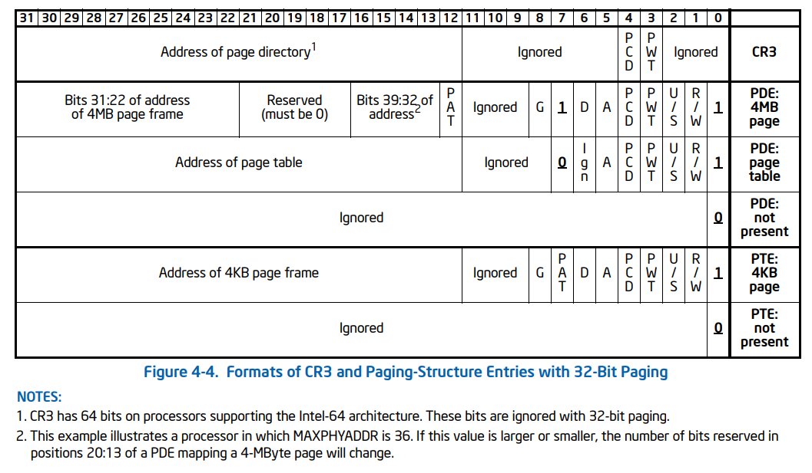

# 写时复制

## 页目录表与页面结构

32 位模式下，Intel 设计了**页目录表**和**页表**两种结构，用来给程序员们提供分页机制：



大部分的操作系统使用的都是 4KB 的页框大小，Linux 0.11 也是，所以只看 4KB 页大小时的情况即可；

一个逻辑地址，要先经过分段机制的转化变成线性地址，再经过分页机制的转化变成物理地址；

比如，分页机制：

.png)

这里的 PDE 就是页目录表项，PTE 就是页表项；

页目录项位含义：

.png)

页表项位含义：

.png)

几乎都是一样的含义，只看页表项就一些比较重要的位：

- 第 31:12 位 --> 表示页的起始物理地址；
- 第 0 位 --> 存在位 Present，存在位：
    - 0 --> 没有对应页面的映射；
    - 1 --> 存在对应页面的映射；
- 第 1 位 --> 表示读写权限：
    - 0 --> 只读，只能向此页表项映射的内存读数据；
    - 1 --> 可读可写；
- 第 2 位 --> 表示用户态还是内核态：
    - 0 表示内核态，那么此时用户态的程序往这个内存范围内写数据，则不允许；

在 Linux 0.11 的 head.s 里，初次为页表设置的值如下：

````assembly
setup_paging:
   ...
    movl $pg0+7,_pg_dir     /* set present bit/user r/w */
    movl $pg1+7,_pg_dir+4       /*  --------- " " --------- */
    movl $pg2+7,_pg_dir+8       /*  --------- " " --------- */
    movl $pg3+7,_pg_dir+12      /*  --------- " " --------- */
    movl $pg3+4092,%edi
    movl $0xfff007,%eax     /*  16Mb - 4096 + 7 (r/w user,p) */
    std
1:  stosl
    ...
````

后三位是 7，用二进制表示就是 111，即初始设置的 4 个页目录表和 1024 个页表，都是：

存在、可读写、用户态；


## 写时复制

### 写时复制的本质

在调用 `fork()` 生成新进程时，新进程与原进程会共享同一内存区。只有当其中一个进程进行写操作时，系统才会为其另外分配内存页面；

### 写时复制的原因

原来的进程通过自己的页表占用了一定范围的物理内存空间


调用 fork 创建新进程时，原本页表和物理地址空间里的内容，都要进行复制


但 fork 函数认为，复制物理地址空间里的内容，比较费时，**所以姑且先只复制页表，物理地址空间的内容先不复制**


如果只有读操作，那就完全没有影响，复不复制物理地址空间里的内容就无所谓了，这样就十分节约时间、空间；

但如果有写操作，那就不得不把物理地址空间里的值复制一份，保证进程间的内存隔离；


### 写时复制的过程

经过 `fork` 后，除了将两个进程的地址映射到一起，而且还修改了这个页面的读写权限为只读：


之后这个两个进程中希望对内存进程写操作， Intel 硬件触发**缺页中断**（0x14  号），来到 Linux 的缺页中断处理函数 `do_page_fault`；

````c
void do_page_fault(..., unsigned long error_code) {
    ...   
    if (error_code & 1)
        do_wp_page(error_code, address, current, user_esp);
    else
        do_no_page(error_code, address, current, user_esp);
    ...
}
````

可以看出，根据中断异常码 `error_code` 的不同，有不同的逻辑，有以下这些：


当 `error_code` 的第 0 位，也就是存在位为 0 时，会走 `do_no_page` 逻辑，其余情况，均走 `do_wp_page` 逻辑；

`fork` 的时候只是将读写位变成了只读，存在位仍然是 1 没有动，所以会走 `do_wp_page` 逻辑：

````c
void do_wp_page(unsigned long error_code,unsigned long address) {
    // 后面这一大坨计算了 address 在页表项的指针
    un_wp_page((unsigned long *)
        (((address>>10) & 0xffc) + (0xfffff000 &
        *((unsigned long *) ((address>>20) &0xffc)))));
}

void un_wp_page(unsigned long * table_entry) {
    unsigned long old_page,new_page;
    old_page = 0xfffff000 & *table_entry;
    // 只被引用一次，说明没有被共享，那只改下读写属性就行了
    if (mem_map[MAP_NR(old_page)]==1) {
        *table_entry |= 2;
        invalidate();
        return;
    }
    // 被引用多次，就需要复制页表了
    new_page=get_free_page()；
    mem_map[MAP_NR(old_page)]--;
    *table_entry = new_page | 7;
    invalidate();
    copy_page(old_page,new_page);
}

// 刷新页变换高速缓冲宏函数
#define invalidate() \
__asm__("movl %%eax,%%cr3"::"a" (0))
````

执行完毕后，把内存复制一次，

````c
new_page=get_free_page();
````

并且更改进程的页表映射关系，并且设置页面可读可写：

```c
*table_entry = new_page | 7;
```


如果进程 1 再写，那么引用次数就等于 1 了，只需要更改下页属性即可，不用进行页面复制操作（看处理函数源码，页面中有字段记录这个页面被引用的次数）；

````c
if (mem_map[MAP_NR(old_page)]==1) ...
````

