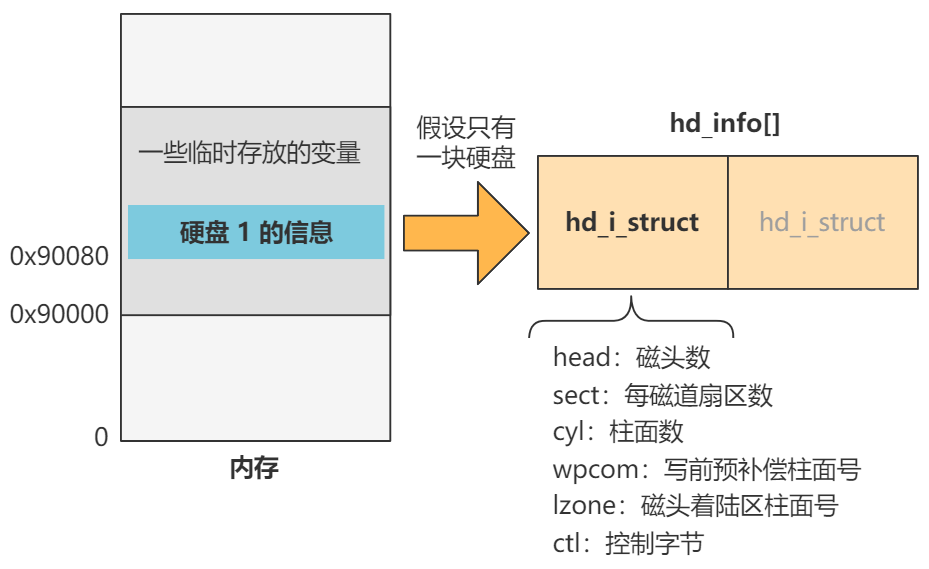
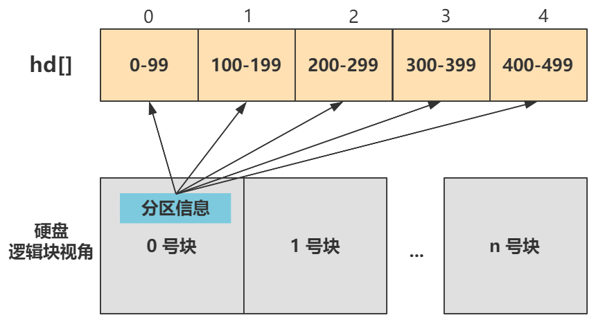

创建好了 1 号进程后，其就要开始发挥作用：进入 `init()` 函数；

````c
void init(void) {
    int pid,i;
    setup((void *) &drive_info);
    (void) open("/dev/tty0",O_RDWR,0);
    (void) dup(0);
    (void) dup(0);
    if (!(pid=fork())) {
        open("/etc/rc",O_RDONLY,0);
        execve("/bin/sh",argv_rc,envp_rc);
    }
    if (pid>0)
        while (pid != wait(&i))
            /* nothing */;
    while (1) {
        if (!pid=fork()) {
            close(0);close(1);close(2);
            setsid();
            (void) open("/dev/tty0",O_RDWR,0);
            (void) dup(0);
            (void) dup(0);
            _exit(execve("/bin/sh",argv,envp));
        }
        while (1)
            if (pid == wait(&i))
                break;
        sync();
    }
    _exit(0);   /* NOTE! _exit, not exit() */
}
````


# 获取硬盘信息

首先进入第一行 `setup((void *) &drive_info);`；

````c
struct drive_info { char dummy[32]; } drive_info;

// drive_info = (*(struct drive_info *)0x90080);

void init(void) {
    setup((void *) &drive_info);
    ...
}
````

`drive_info` 来自内存 0x90080 的数据，这部分是由 setup 程序将硬盘 1 的参数信息放在这里，包括柱面数、磁头数、扇区等信息；

`setup` 函数是一个系统调用，最后通过两次查表进入 `sys_setup` 函数：

````c
int sys_setup(void * BIOS) {

    hd_info[0].cyl = *(unsigned short *) BIOS;
    hd_info[0].head = *(unsigned char *) (2+BIOS);
    hd_info[0].wpcom = *(unsigned short *) (5+BIOS);
    hd_info[0].ctl = *(unsigned char *) (8+BIOS);
    hd_info[0].lzone = *(unsigned short *) (12+BIOS);
    hd_info[0].sect = *(unsigned char *) (14+BIOS);
    BIOS += 16;

    hd[0].start_sect = 0;
    hd[0].nr_sects = 
        hd_info[0].head * hd_info[0].sect * hd_info[0].cyl;
    
    struct buffer_head *bh = bread(0x300, 0);
    struct partition *p = 0x1BE + (void *)bh->b_data;
    for (int i=1;i<5;i++,p++) {
        hd[i].start_sect = p->start_sect;
        hd[i].nr_sects = p->nr_sects;
    }
    brelse(bh);
    
    rd_load();
    mount_root();
    return (0);
}
````

往下执行：


## 1. 从 `0x90080` 获取硬盘信息

首先进入此函数的第一部分，硬盘基本信息的赋值操作：

````c
int sys_setup(void * BIOS) {
    hd_info[0].cyl = *(unsigned short *) BIOS;
    hd_info[0].head = *(unsigned char *) (2+BIOS);
    hd_info[0].wpcom = *(unsigned short *) (5+BIOS);
    hd_info[0].ctl = *(unsigned char *) (8+BIOS);
    hd_info[0].lzone = *(unsigned short *) (12+BIOS);
    hd_info[0].sect = *(unsigned char *) (14+BIOS);
    BIOS += 16;
    ...
}
````

刚刚提过，入参 BIOS 是来自内存 0x90080 的数据，这部分是由之前的硬盘 1 的参数信息放在这里了：柱面数量、磁头数量、扇区数量等信息；

所以这里先往 `hd_info` 数组的 0 索引处存上这些信息。假设只有一块硬盘，所以这些数组只有一个元素；

`hd_info` 数组的保存的数据结构是 `hd_i_struct` 就表示硬盘的参数：

````c
struct hd_i_struct {
    // 磁头数、每磁道扇区数、柱面数、写前预补偿柱面号、磁头着陆区柱面号、控制字节
    int head,sect,cyl,wpcom,lzone,ctl;
};
struct hd_i_struct hd_info[] = {}；
````

最后得到的效果：




## 2. 创建 `hd` 数据设置硬盘分区表

继续第二部分，硬盘分区表的设置：

````c
static struct hd_struct {
    long start_sect;
    long nr_sects;
} hd[5] = {}

int sys_setup(void * BIOS) {
    ...
    hd[0].start_sect = 0;
    hd[0].nr_sects = 
        hd_info[0].head * hd_info[0].sect * hd_info[0].cyl;
    struct buffer_head *bh = bread(0x300, 0);
    struct partition *p = 0x1BE + (void *)bh->b_data;
    for (int i=1;i<5;i++,p++) {
        hd[i].start_sect = p->start_sect;
        hd[i].nr_sects = p->nr_sects;
    }
    brelse(bh);
    ...
}
````

定义了 `hd_struct` 类型的数组 `hd`，之后给 `hd` 数组的五项赋值：


`hd_struct` 表示硬盘分区的信息，每个分区用 `start_sect` 和 `nr_sects` 也就是开始扇区和总扇区数来记录；

这些信息从硬盘的第一个扇区的 0x1BE 偏移处获取，这里存储着该硬盘的分区信息；

这就是 `bread` 函数所完成的：

````c
struct buffer_head *bh = bread(0x300, 0);
````

- 第一个参数 0x300 是第一块硬盘的主设备号，就表示要读取的块设备是硬盘1；
- 第二个参数 0 表示读取第一个块，一个块为 1024 字节大小，也就是连续读取硬盘开始处 0 - 1024 字节的数据；

拿到这部分数据后，再取 0x1BE 偏移处，就得到了分区信息：

````c
struct partition *p = 0x1BE + (void *)bh->b_data;
````




## 3. 加载根文件系统

现在已经把硬盘的基本信息存入 `hd_info[]`，把硬盘分区信息存入 `hd[]`；继续：

````
int sys_setup(void * BIOS) {
    ...
    rd_load();
    mount_root();
    return (0);
}
````

- 其中 `rd_load` 是当有 ramdisk 时，也就是虚拟内存盘，才会执行。虚拟内存盘是通过软件将一部分内存（RAM）模拟为硬盘来使用的一种技术；这里不展开；
- `mount_root` 直译过来就是加载，即**加载根文件系统**，有了它之后，操作系统才能从一个根开始找到所有存储在硬盘中的文件，所以它是文件系统的基石，很重要；

为了加载根文件系统，就是把硬盘中的数据加载到内存里，以文件系统的数据格式来解读这些信息。

需要硬盘本身有文件系统的信息，不能是裸盘，不归操作系统管理，启动 Linux0.11 必须要一块做好文件系统的硬盘；

并且需要读取硬盘数据到内存，就必须直到硬盘的参数信息，也就是之前完成的事情；


 

