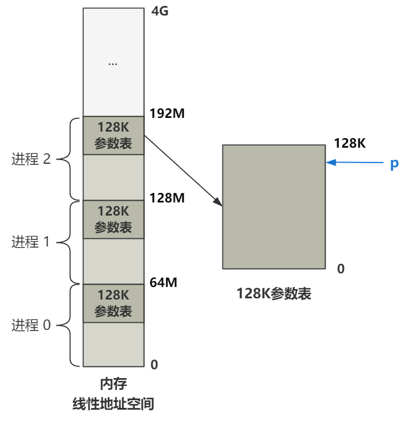

进程 2 被创建出来，执行 `if` 内的程序：

````c
void init(void) {
    ...
    if (!(pid=fork())) {
        close(0);
        open("/etc/rc",O_RDONLY,0);
        execve("/bin/sh",argv_rc,envp_rc);
        _exit(2);
    }
    ...
}
````

# 执行 `execve` 函数

其中有调用到一个 `execve` 函数：

````c
static char * argv_rc[] = { "/bin/sh", NULL };
static char * envp_rc[] = { "HOME=/", NULL };

// 调用方
execve("/bin/sh",argv_rc,envp_rc);

// 宏定义
_syscall3(int,execve,const char *,file,char **,argv,char **,envp)

// 通过系统调用进入到这里
EIP = 0x1C
_sys_execve:
    lea EIP(%esp),%eax
    pushl %eax
    call _do_execve
    addl $4,%esp
    ret

// 最终执行的函数
int do_execve(
        unsigned long * eip,
        long tmp,
        char * filename,
        char ** argv,
        char ** envp) {
    ...
}
````

作为一个系统调用，与 `fork` 类似，经过两次查表，最后进入 `do_execve` 函数执行，这个函数有一些参数：

- `eip`：调用方触发系统调用时由 CPU 压入栈空间的 eip 指针；就是调用 `execve` 系统调用前，会执行的几个压栈动作；
- `temp`：无用的参数占位；
- `filename`：是调用 `execve` 时的第一个参数：`"/bin/sh"`；
- `argv`：调用 `execve` 时的第二个参数：`argv_rc` 一个字符串数组，为 `{ "/bin/sh", NULL }`；
- `envp`：调用 `execve` 时的第三个参数：`envp_re` 一个字符串数组，为 `{ "HOME=/", NULL }`；

接下来进入 `do_execve`，简化后如下

````c
int do_execve(...) {
    // 检查文件类型和权限等
    ...
    // 读取文件的第一块数据到缓冲区
    ...
    // 如果是脚本文件，走这里
    if (脚本文件判断逻辑) {
        ...
    }
    // 如果是可执行文件，走这里
    // 一堆校验可执行文件是否能执行的判断
    ...
    // 进程管理结构的调整
    ...
    // 释放进程占有的页面
    ...
    // 调整线性地址空间、参数列表、堆栈地址等
    ...
    // 设置 eip 和 esp，这里是 execve 变身大法的关键！
    eip[0] = ex.a_entry;
    eip[3] = p;
    return 0;
    ...
}
````

大致的步骤是：

1. 检查文件的类型和权限；
2. 读取文件的第一块数据到缓冲区；
3. 脚本文与可执行文件的判断；
4. 校验可执行文件是否可以执行；
5. 进程管理结构的跳转；
6. 释放进程占有的页面；
7. 调整线性地址空间，参数列表、堆栈地址等；
8. 设置 eip 和 esp；

其中最核心的逻辑是：加载文件、调整内存、开始执行；下面就三个核心逻辑分许：

## 1. 读取开头的 1KB 的数据

根据文件名称，找到并且读取文件的内容：

````c
// exec.c
int do_execve(...) {
    ...
    // 根据文件名 /bin/sh 获取 inode
    struct m_inode * inode = namei(filename);
    // 根据 inode 读取文件第一块数据（1024KB）
    struct buffer_head * bh = bread(inode->i_dev,inode->i_zone[0]);
    ...
}
````

只读取了文件的第一块数据（1KB），已经说过，0 - 6 是直接映射，那么`inode->i_zone[0]`  就是文件开头 1KB 的数据；

.png)

现在，内存中已经获取了这 1KB 的数据；

## 2. 解析 1KB 的数据为 exec 结构

````c
// exec.c
int do_execve(...) {
    ...
    struct exec ex = *((struct exec *) bh->b_data);
    ...
}
````

先从刚刚读取文件返回的缓存头指针中取出数据部分 `bh->data`，也就是文件前 1024 个字节，此时其中还是一段二进制数据；

现在按照 exec 这个结构体对其解析：

````c
struct exec {
    // 魔数
    unsigned long a_magic;
    // 代码区长度
    unsigned a_text;
    // 数据区长度
    unsigned a_data;
    // 未初始化数据区长度
    unsigned a_bss;
    // 符号表长度
    unsigned a_syms;
    // 执行开始地址
    unsigned a_entry;
    // 代码重定位信息长度
    unsigned a_trsize;
    // 数据重定位信息长度
    unsigned a_drsize;
};
````

上面的代码就是 exec 结构体，这是 **a.out** 格式文件的头部结构，现在的 Linux 已经弃用了这种古老的格式，改用 ELF 格式了，但大体的思想是一致的，就是说按照这个结构体的约定，把执行文件的信息放置好；

## 3. 判断是脚本文件还是可执行文件

编写 Linux 脚本文件时，通常会在开头看到这样的内容：

````sh
#!/bin/sh
#!/usr/bin/python
````

而之所以写上这样的内容就可以按照脚本文件执行，就是因为 `execve` 函数内部的逻辑：

````c
// exec.c
int do_execve(...) {
    ...
    if ((bh->b_data[0] == '#') && (bh->b_data[1] == '!') {
        ...
    }
    brelse(bh);
    ...
}
````

判断前两个字符是不是 `#!`，如果是的话，就走脚本文件的执逻辑；

而现在执行的 /bin/sh 是一个可执行二进制文件，非脚本文件，不满足这个条件，所以程序流到可执行文件的执行逻辑；

注意将 `bh` 被释放，因为已经把这个缓冲块内容解析成 exec 结构保存到内存中了；

## 4. 准备参数空间

执行 /bin/sh 时，还给它传了 argc 和 envp 参数，就是通过下面这一系列代码来实现的：

````c
#define PAGE_SIZE 4096
#define MAX_ARG_PAGES 32

// exec.c
int do_execve(...) {
    ...
    // p = 0x1FFFC = 128K - 4
    unsigned long p = PAGE_SIZE * MAX_ARG_PAGES - 4;
    ...
    // p = 0x1FFF5 = 128K - 4 - 7
    p = copy_strings(envc,envp,page,p,0);
    // p = 0x1FFED = 128K - 4 - 7 - 8
    p = copy_strings(argc,argv,page,p,0);
    ...
    // p = 0x3FFFFED = 64M - 4 - 7 - 8
    p += change_ldt(ex.a_text,page)-MAX_ARG_PAGES*PAGE_SIZE;
    // p = 0x3FFFFD0
    p = (unsigned long) create_tables((char *)p,argc,envc);
    ...
    // 设置栈指针
    eip[3] = p;
}
````

准备参数空间的过程，同时也伴随着一个表示地址的 unsigned long p 的计算轨迹；

### 计算 `p`

首先第一行计算出 p :

````c
p = PAGE_SIZE * MAX_ARG_PAGES - 4 = 128K - 4;
````

至于为什么是这个数字，就需要了解一些关于进程参数表的知识；

进程可能会带有一些参数，操作系统为每个进程准备了 128K 的空间存放进程的参数，并且放置在进程地址空间的最后 128K；

创建 1 号进程时就知道，操作系统将每个进程的线性地址空间分配到单独的 64M 空间中，此时系统中存在三个进程：

 .png)

而参数表为 128K，表示每个进程的线性地址空间的尾端 128K，是为参数表保留的，目前这个 p 就指向参数表的开始处（偏移 4 字节）



### 拷贝字符串参数

回归正题，继续执行：

```c
// exec.c
int do_execve(...) {
    ...
    // p = 0x1FFF5 = 128K - 4 - 7
    p = copy_strings(envc,envp,page,p,0);
    // p = 0x1FFED = 128K - 4 - 7 - 8
    p = copy_strings(argc,argv,page,p,0);
    ...
}
```

两个 `copy_strings` 就是往这个参数表里面存放信息，不过具体存放的只是字符串常量值的信息，随后他们将被引用；

比如，`envp` 表示字符串参数 `"HOME=/"`，`argv` 表示字符串参数 `"/bin/sh"`，两个 copy 就表示把这个字符串参数往参数表里存，相应地指针 p 也往下移动（共移动了 7 + 8 = 15 个字节），和压栈的效果是一样的：

.png)

现在字符串被安排在参数表内存，并且之间用 NULL 分隔；

## 5. 更新局部描述符 LDT

````c
#define PAGE_SIZE 4096
#define MAX_ARG_PAGES 32

// exec.c
int do_execve(...) {
    ...
    // p = 0x3FFFFED = 64M - 4 - 7 - 8
    p += change_ldt(ex.a_text,page)-MAX_ARG_PAGES*PAGE_SIZE;
    ...
}
````

根据 `ex.a_text` 修改局部描述符中的**代码段限长**  `code_limit`；

ex 结构里的 a_text 是生成 /bin/sh 这个 a.out 格式的文件时，写在头部的值，用来表示代码段的长度；

由于这个函数返回值是数据段限长，也就是 64M，所以最终的 p 值被调整为了以每个进程的线性地址空间视角下的地址偏移：

.png)

## 6. 构造参数表

````c
#define PAGE_SIZE 4096
#define MAX_ARG_PAGES 32

// exec.c
int do_execve(...) {
    ...
    // p = 0x3FFFFD0
    p = (unsigned long) create_tables((char *)p,argc,envc);
    ...
}
````

刚刚仅仅是往参数表里面丢入了需要的字符串常量值信息，现在就需要真正把参数表构建起来；

展开 `create_tables`：

````c
/*
 * create_tables() parses the env- and arg-strings in new user
 * memory and creates the pointer tables from them, and puts their
 * addresses on the "stack", returning the new stack pointer value.
 */
static unsigned long * create_tables(char * p,int argc,int envc) {
    unsigned long *argv,*envp;
    unsigned long * sp;

    sp = (unsigned long *) (0xfffffffc & (unsigned long) p);
    sp -= envc+1;
    envp = sp;
    sp -= argc+1;
    argv = sp;
    put_fs_long((unsigned long)envp,--sp);
    put_fs_long((unsigned long)argv,--sp);
    put_fs_long((unsigned long)argc,--sp);
    while (argc-->0) {
        put_fs_long((unsigned long) p,argv++);
        while (get_fs_byte(p++)) /* nothing */ ;
    }
    put_fs_long(0,argv);
    while (envc-->0) {
        put_fs_long((unsigned long) p,envp++);
        while (get_fs_byte(p++)) /* nothing */ ;
    }
    put_fs_long(0,envp);
    return sp;
}
````

最后的结果：

.png)

最后将 sp 返回给 p，这样 p 成为了新的栈顶指针，给即将完成替换的 /bin/sh 程序：

````c
// exec.c
int do_execve(...) {
    ...
    // 设置栈指针
    eip[3] = p;
}
````

## 7. 设置 eip 和 esp

````c
// exec.c
int do_execve(unsigned long * eip, ...) {
    ...
    eip[0] = ex.a_entry;
    eip[3] = p; 
    ...
}
````

一个程序开始执行，即代码指针 eip 和栈指针 esp 指向了一个新的地方；

代码指针 eip 决定了 CPU 将执行哪一段指令，栈指针 esp 决定了 CPU 压栈操作的位置，以及读取栈空间数据的位置，在高级语言视角下就是**局部变量**以及**函数调用链的栈帧**；

这个两个代码，第一行重新设置了代码指针 eip 的值，指向 bin/sh 这个 a.out 格式文件的头文件夹结构 exec 中的 a_entry 字段，表示该程序的入口地址；

第二行重新设置了栈指针 esp 的值，指向了之前计算得到的 p，作为栈顶；

.png)

那么，现在程序已经具备了执行的条件；

至于为什么往 eip 的 0 和 3 索引位置处写入数据，就可以达到替换 eip 和 esp 的目的；

`execve` 是一个系统调用，也是一个中断，那么执行中断之前 CPU 会给栈空间里压入一定的信息：
.png)

然后，进入中断以后，通过系统调用查表进入到 **_sys_execve** 这里：

````c
EIP = 0x1C
_sys_execve:
    lea EIP(%esp),%eax
    pushl %eax
    call _do_execve
    addl $4,%esp
    ret
````

在真正调用 `do_execve` 函数时，`_sys_execve` 这段代码偷偷地插入了一个小步骤，就是把当前栈顶指针 esp 偏移到 EIP 处的地址值给当做第一个参数 `unsigned long  eip` 传入进来；

.png)

中断返回后，会把 eip 与 esp 的值读回 CPU，进入一个新的程序执行；


# 结果

至此，`execve` 函数结束，进程 2 脱离了进程 1 原有的代码，进入 bash 程序；

````c
void init(void) {
    ...
    if (!(pid=fork())) {
        close(0);
        open("/etc/rc",O_RDONLY,0);
        execve("/bin/sh",argv_rc,envp_rc);
        _exit(2);
    }
    ...
}
````


