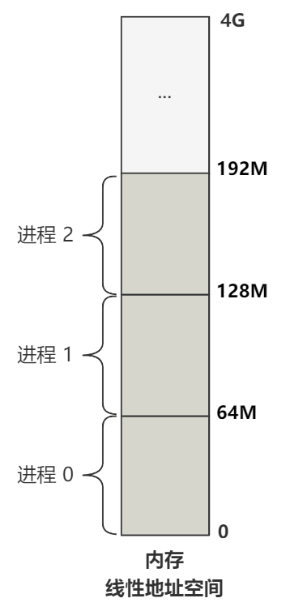

# 缺页中断

## 缺页的产生

至此，完成了 `fork()` + `execve` 的组合，先拷贝一个子进程 2，之后在进程 2 调用 `execve` 执行 /bin/sh 程序；

现在的问题是，`execve` 函数只加载了 /bin/sh 的头部到内存中，其他的代码段、数据段等都在磁盘中；

.png)

那么现在 CPU 的 eip 得到了 sh 的程序入口，开始执行，这就引出了一些问题；

**跳转到一个不存在的地址会发送什么？**

/bin/sh 这个文件并不是 Linux 0.11 源码里的内容，Linux 0.11 只管按照 a.out 这种格式去解读它，跳转到 a.out 格式头部数据结构 **exec.a_entry** 所指向的内存地址去执行指令；

这个 a_entry 的值是多少，取决于硬盘中 /bin/sh 这个文件的构造，假设是 0，那么随后 CPU 将跳转到 0 地址执行；

这个 0 仅仅代表了逻辑地址，既没有进行分段，也没有分页；

而此时系统的线性地址空间被操作系统分给三个进程，每个进程 64M：



现在执行的是进程 2，所以逻辑地址 0 通过分段机制被映射到了线性地址空间 128M 的位置；

随后 128M 这个线性地址就会通过分页机制得到最后的物理地址；

但此时，进程 2 的页面中没有关于 128M 线性地址的映射，因为 /bin/sh 文件的内容还没有被加载到内存；

当 MMU 拿着 128M 的这个地址去查表，最后得到的页表项的存在为 P 为 0；

此时 CPU 触发中断：**页错误（Page-Fault）**；

## 缺页处理

### 1. 根据错误码进入不同的处理函数

而 Page-Fault 的触发情况很多，具体在何时触发，CPU 会帮出错码 Error Code 保存；

按照流程，发送中断后进入中断处理函数：

````c
void do_page_fault(..., unsigned long error_code) {
    ...   
    if (error_code & 1)
        do_wp_page(error_code, address, current, user_esp);
    else
        do_no_page(error_code, address, current, user_esp);
    ...
}
````

会进入很多的判断，根据错误码进入不同的处理函数，而此时出错是遇到了页表项存在位 p 为 0 的情况，所以 error_code  的第 0 位是 0，进入 `do_no_page` ；

### 2. 执行 `do_no_page`

主要的代码为：

````c
// memory.c
// address 缺页产生的线性地址 0x8000000
void do_no_page(unsigned long address) {
    // 线性地址的页面地址 0x8000000
    address &= 0xfffff000;
    // 计算相对于进程基址的偏移 0
    unsigned long tmp = address - current->start_code;
    // 寻找空闲的一页内存
    unsigned long page = get_free_page();
    // 计算这个地址在文件中的哪个数据块 1
    int block = 1 + tmp/BLOCK_SIZE;
    // 一个数据块 1024 字节，所以一页内存需要读 4 个数据块
    int nr[4];
    for (int i=0 ; i<4 ; block++,i++)
        nr[i] = bmap(current->executable,block);
    bread_page(page,current->executable->i_dev,nr);
    ...
    // 完成页表的映射
    put_page(page,address);
}
````

### 3. 地址对齐

首先会让出错的线性地址对 4KB 对齐，128M 就是对 4KB 对齐的，所以不用改变；

### 4. 获取相对地址

由于这个地址是整个线性地址空间的地址，所以对每个进程，需要计算出这个地址相对进程起始线性地址的偏移，即去掉进程的段基址部分；

````c
// memory.c
// address 缺页产生的线性地址 0x8000000
void do_no_page(unsigned long address) {
    ...
    // 计算相对于进程基址的偏移 0
    unsigned long tmp = address - current->start_code;
    ...
}
````

这里的 `current->start_code` 就是进程 2 的段基址，也是 128M；

.png)

所以偏移地址 `tmp` 是 0；

### 5. 申请空闲页面

接下来需要到一个空闲页面：

````c
// memory.c
// address 缺页产生的线性地址 0x8000000
void do_no_page(unsigned long address) {
    ...
    // 寻找空闲的一页内存
    unsigned long page = get_free_page();
    ...
}
````

`get_free_page` 已经说过，根据 `mem_map` 数组找到主存中一个空闲的页面；

.png)

### 6. 加载硬盘数据到内存

找到一页物理内存后，当然是把硬盘中的数据加载进来，下面的代码就是完成这个工作：

````c
// memory.c
// address 缺页产生的线性地址 0x8000000
void do_no_page(unsigned long address) {
    ...
    // 计算这个地址在文件中的哪个数据块 1
    int block = 1 + tmp/BLOCK_SIZE;
    // 一个数据块 1024 字节，所以一页内存需要读 4 个数据块
    int nr[4];
    for (int i=0 ; i<4 ; block++,i++)
        nr[i] = bmap(current->executable,block);
    bread_page(page,current->executable->i_dev,nr);
    ...
}
````

/bin/sh 文件的第一个数据库作为头部 exec 结构，所以跳过头部，从这个文件的 1 号数据块开始读取；

硬盘的一个数据块是 1024 字节，一页内存为 4096 字节，所以每次读入一个页面需要 4 个硬盘数据块，所以 `int nr[4]`；

之后 `bmap` 函数赋值将相对于文件的数据块转换为相对于硬盘的数据库；

`bread_page` 就是连续读取 4 个数据块到 1 也内存的函数；

### 7. 构建页表映射

最后调用 `put_page`，完成页表的映射：

````c
// memory.c
// address 缺页产生的线性地址 0x8000000
void do_no_page(unsigned long address) {
    ...
    // 完成页表的映射
    put_page(page,address);
}
````

这是因为此时仅仅是申请了物理内存页，并且把硬盘数据复制了进来，但并没有把这个物理内存页和线性地址空间的内存页进行映射，也就是没建立相关的**页表**；

.png)

展开 `put_page`，化简一下函数，只考虑页目录还不在的情况：

````c
// memory.c
unsigned long put_page(unsigned long page,unsigned long address) {
    unsigned long tmp, *page_table;
    // 找到页目录项
    page_table = (unsigned long *) ((address>>20) & 0xffc);
    // 写入页目录项
    tmp = get_free_page();
    *page_table = tmp|7;
    // 写入页表项
    page_table = (unsigned long *) tmp;
    page_table[(address>>12) & 0x3ff] = page | 7;
    return page;
}
````
