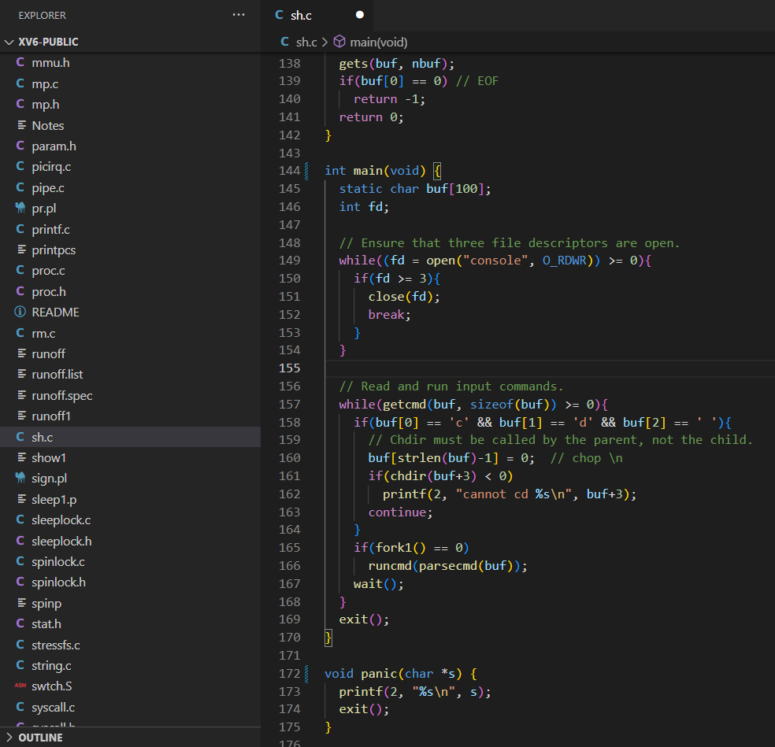

# 运行 shell 程序

Shell 只是一个程序，不断读取用户的输入，根据命令执行某些动作，或者执行可执行文件、脚本文件等；

Shell 并不属于操作系统，所以不会着重介绍；



化简一下，大概就这些：

````c
// xv6-public sh.c
int main(void) {
    static char buf[100];
    // 读取命令
    while(getcmd(buf, sizeof(buf)) >= 0){
        // 创建新进程
        if(fork() == 0)
            // 执行命令
            runcmd(parsecmd(buf));
        // 等待进程退出
        wait();
    }
}
````

