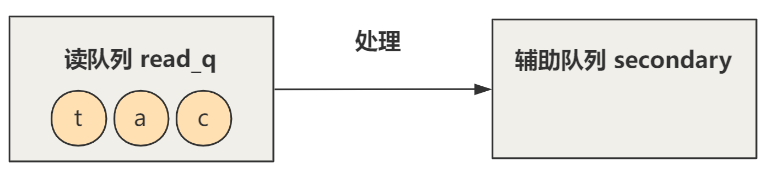

# 输入命令的过程

## 1. 键盘输入

shell 程序已经打开，还没输入任何内容：

````bash
[root@linux0.11]
````

在 shell 中按下按键 `'c'`；

## 2. 触发中断

按下按键后，CPU 发生中断：

````c
// console.c
void con_init(void) {
    ...
    set_trap_gate(0x21,&keyboard_interrupt);
    ...
}
````

键盘中断被绑定在了 `keyborad_interrupt` 函数，输入 `c` 后立刻进入；

## 3. 执行 `keyborad_interrupt`

````assembly
// keyboard.s
keyboard_interrupt:
    ...
    // 读取键盘扫描码
    inb $0x60,%al
    ...
    // 调用对应按键的处理函数
    call *key_table(,%eax,4)
    ...
    // 0 作为参数，调用 do_tty_interrupt
    pushl $0
    call do_tty_interrupt
    ...
````

### 3.1 获取按键码

通过 IO 端口的操作（与外设交互通过端口），从键盘中读取键盘扫描码，即记录了 `c`；

### 3.2 进入处理函数

在 `key_table` 中寻找不同按键对应的不同处理函数；

如下为 `keyboard.s` 的源码，对不同的字符执行不同的函数；

````assembly
// keyboard.s
key_table:
    .long none,do_self,do_self,do_self  /* 00-03 s0 esc 1 2 */
    .long do_self,do_self,do_self,do_self   /* 04-07 3 4 5 6 */
    ...
    .long do_self,do_self,do_self,do_self   /* 20-23 d f g h */
    ...
````

对普通的字符 `c`  就执行 `do_self`：

````assembly
// keyboard.s
do_self:
    ...
    // 扫描码转换为 ASCII 码
    lea key_map,%ebx
    1: movb (%ebx,%eax),%al
    ...
    // 放入队列
    call put_queue
````

- 首先将字符转为 ASCII 码；

- 执行 `put_queue`；

    ````c
    // keyboard.s
    put_queue:
        ...
        movl table_list,%edx # read-queue for console
        movl head(%edx),%ecx
        ...
    ````

    根据源码，将这个 ASII 码放入到某个队列中，具体是什么队列之后再看；

### 3.3 执行 `do_tty_interrupt`

继续执行 `do_tty_interrupt` 中断中断处理函数，首先传递一个参数 0；

````c
// tty_io.c
void do_tty_interrupt(int tty) {
    copy_to_cooked(tty_table+tty);
}

void copy_to_cooked(struct tty_struct * tty) {
    ...
}
````

这里的参数 `tty` 就是 0，函数找到 `tty_table` 中的第 0 项作为函数 `copy_to_cooked` 的参数；

`tty_table` 是**终端设备表**，在 Linux 0.11 中有三项：

- **控制台终端**；
- **串行终端1；**
- **串行终端2；**

````c
// tty.h
struct tty_struct tty_table[] = {
    {
        {...},
        0,          /* initial pgrp */
        0,          /* initial stopped */
        con_write,
        {0,0,0,0,""},       /* console read-queue */
        {0,0,0,0,""},       /* console write-queue */
        {0,0,0,0,""}        /* console secondary queue */
    },
    {...},
    {...}
};
````

PS：这里只显示了第一个 `tty_struct` 结构体的内容，其他两个用 `...`

根据源码，找到 `tty_table` 的第一项就是展示出的这个 `tty_struct` 作为参数传入，其代表了**控制台终端**；

`tty_struct` 用来描述一个终端的属性：

````c
struct tty_struct {
    struct termios termios;
    int pgrp;
    int stopped;
    void (*write)(struct tty_struct * tty);
    struct tty_queue read_q;
    struct tty_queue write_q;
    struct tty_queue secondary;
};

struct tty_queue {
    unsigned long data;
    unsigned long head;
    unsigned long tail;
    struct task_struct * proc_list;
    char buf[TTY_BUF_SIZE];
};
````

- `termios`：定义了终端的各种模式：读模式、写模式、控制模式...；
- `void (* write)(struct tty_struct* tty)` 定义了一个返回值为 `void`，参数为 `struct tty_struct*` 的函数，把这个函数绑定在了这个终端上。在控制台终端中，其被定义为 `con_write`；
- 三个 `struct tty_queue`：
    - 读队列：`read_q`；
    - 写队列：`write_q`；
    - 辅助队列：`secondary`；

这里就出现了 `struct tty_queue`，一个队列结构体，根据 `put_queue`：

````c
// tty_io.c
struct tty_queue * table_list[]={
    &tty_table[0].read_q, &tty_table[0].write_q,
    &tty_table[1].read_q, &tty_table[1].write_q,
    &tty_table[2].read_q, &tty_table[2].write_q
};

// keyboard.s
put_queue:
    ...
    movl table_list,%edx # read-queue for console
    movl head(%edx),%ecx
    ...
````

显然，这里的 `table_list` 首地址，是 `tty_table[0].read_q` 的地址，这就对应了**控制台终端**的 `read_q` 队列；

所以现在终于知道，`put_queue` 是把转换得到的 ASCII 码放入用来描述控制台终端的 `tty_struct` 中的读队列 `read_q`中；

### 3.4 执行 `copy_to_cooked`

```c
// tty_io.c
void copy_to_cooked(struct tty_struct * tty) {
    signed char c;
    while (!EMPTY(tty->read_q) && !FULL(tty->secondary)) {
        // 从 read_q 中取出字符
        GETCH(tty->read_q,c);
        ...
        // 这里省略了一大坨行规则处理代码
        ...
        // 将处理过后的字符放入 secondary
        PUTCH(c,tty->secondary);
    }
    wake_up(&tty->secondary.proc_list);
}
```

一个循环，只要读队列 `read_q` 不为空（由 `put_queue` 将 ASCII 码放入），辅助队列 `secondary` 没有满，就不断从 `read_q` 中取出字符，经过一些处理加入到 `secondary` 队列中；



否则，就唤醒等待这个辅助队列 `secondary` 的进程，之后怎么做就由进程自己决定；

而中间的处理有很多分支，这里举一个例子：

````c
#define IUCLC   0001000
#define _I_FLAG(tty,f)  ((tty)->termios.c_iflag & f)
#define I_UCLC(tty) _I_FLAG((tty),IUCLC)

void copy_to_cooked(struct tty_struct * tty) {
    ...
    // 这里省略了一大坨行规则处理代码
    if (I_UCLC(tty))
        c=tolower(c);
    ...
}
````

通过判断 `tty` 中的 `termios` ，来决定对读出的字符 `c` 做一些处理；

在这里，就是判断 `termios` 中的 `c_iflag` 中的第 4 位是否为 1，来决定是否要将读出的字符 `c` 由大写变为小写；

这个 `termios` 就是定义了终端的**模式**，`struct termios` 定义为：

````c
struct termios {
    unsigned long c_iflag;      /* input mode flags */
    unsigned long c_oflag;      /* output mode flags */
    unsigned long c_cflag;      /* control mode flags */
    unsigned long c_lflag;      /* local mode flags */
    unsigned char c_line;       /* line discipline */
    unsigned char c_cc[NCCS];   /* control characters */
};
````

比如刚刚的是否要将大写变为小写，是否将回车字符替换成换行字符，是否接受键盘控制字符信号如 ctrl + c 等；

PS：这些模式不是 Linux 0.11 自己乱想出来的，而是实现了 **POSIX.1** 中规定的 **termios 标准**；

此时有这样的流程：

.png)

---

## 4. 上层进程处理

现在字符已经被放入 `secondary` 队列中；而键盘中断的任务也应该到此结束，具体这个字符输入后代表什么，应该由上层的应用自己决定；

上层经过库函数、文件系统函数等，最终会调用到 tty_read 函数，将字符从 `secondary` 队列里取走：

````c
// tty_io.c
int tty_read(unsigned channel, char * buf, int nr) {
    ...
    GETCH(tty->secondary,c);
    ...
}
````

而上层应用的处理函数就不能确定了，假如要写到控制台终端，那上层应用程序又会经过库函数、文件系统函数等层层调用，最终调用到 `tty_write` 函数：

````c
// tty_io.
int tty_write(unsigned channel, char * buf, int nr) {
    ...
    PUTCH(c,tty->write_q);
    ...
    tty->write(tty);
    ...
}
````

- 将字符放入 `tty` 的 `wtite_q` 队列中；

- 调用 `tty` 的 `write` 函数；

    对控制台终端，这个函数是 `con_write`：

    ````c
    // console.c
    void con_write(struct tty_struct * tty) {
          ...
    }
    ````

    配合着显卡，最后显示出用户输入的字符；

---


# 总结

经过梳理，整个过程：

.png)

核心点就是三个队列 

- `read_q`

    键盘按下按键后，进入到键盘中断处理程序 `keyboard_interrupt` 里，最终通过 `put_queue` 函数字符放入 `read_q` 这个队列；

- `secondary` 

    通过 `copy_to_cooked` 函数，经过一定的 `termios` 规范处理后，将处理过后的字符放入 `secondary`；

- `write_q`

    进程通过 `tty_read` 从 `secondary` 里读字符，通过 `tty_write` 将字符写入 `write_q`，最终 `write_q` 中的字符可以通过 `con_write` 这个控制台写函数，将字符打印在显示器上；


