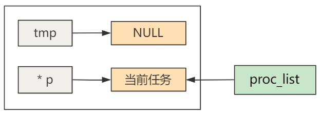

# 进程的阻塞与唤醒

## 进程阻塞与唤醒的原理

### 进程状态

Linux 中表示进程的数据结构是 `task_struct`，其中有一个 `state` 字段表示进程的状态，在 Linux 0.11 中有五种枚举值：

````c
// shed.h
#define TASK_RUNNING 0      // 运行态
#define TASK_INTERRUPTIBLE 1    // 可中断等待状态。
#define TASK_UNINTERRUPTIBLE 2  // 不可中断等待状态
#define TASK_ZOMBIE 3       // 僵死状态
#define TASK_STOPPED 4      // 停止
````

进程被创建时，`state = 0`，表示运行态；

 ````c
 // system_call.s
 _sys_fork:
     ...
     call _copy_process
     ...
 
 // fork.c
 int copy_process(...) {
     ...
     p->state = TASK_RUNNING;
     ...
 }
 ````

只有当处于运行态的进程，才会被调度机制选中，送入 CPU 开始执行，这可以从调度函数佐证：

````c
// sched.c
void schedule (void) {
    ...
    if ((*p)->state == TASK_RUNNING && (*p)->counter > c) {
        ...
        next = i;
    }
    ...
    switch_to (next);
}
````

所以只要让某个进程的 `task_struct` 中的 `state` 不为 0，那么这个进程就不会被调用，也就是阻塞；

而唤醒进程就是把 `state` 改为 0，进入下一次进程调度；

Linux 0.11 中使用 `sleep_on` 与 `wake_up` 函数进行进程的阻塞与唤醒：

### `sleep_on`

`sleep_on` 函数将 `state` 变为 `TASK_UNINTERRUPTIBLE`

````c
// sched.c
void sleep_on (struct task_struct **p) {
    struct task_struct *tmp;
    ...
    tmp = *p;
    *p = current;
    current->state = TASK_UNINTERRUPTIBLE;
    schedule();
    if (tmp)
        tmp->state = 0;
}
````

### `wake_up`

而 `wake_up` 函数将 `state` 变回为 `TASK_RUNNING`，也就是 0；

````c
// sched.c
void wake_up (struct task_struct **p) {
    (**p).state = 0;
}
````

## `sleep_on` 分析

`wake_up` 比较非常简单易懂，就是这个 `sleep_on` 需要分析一下；

还是以 shell 被阻塞为例子：

````c
int tty_read(unsigned channel, char * buf, int nr) {
    ...
    sleep_if_empty(&tty->secondary);
    ...
}

static void sleep_if_empty(struct tty_queue * queue) {
    ...
    interruptible_sleep_on(&queue->proc_list);
    ...   
}
````

其中 `interruptible_sleep_on` 函数就是对 `sleep_on` 多一层封装；

而其参数 `&queue->proc_list`，就需要分析一波：

````c
struct tty_queue {
    ... 
    struct task_struct * proc_list;
};

struct tty_struct {
    ...
    struct tty_queue secondary;
};
````

首先，`queue` 是函数参数 `struct tty_queue*`，这个结构体中包含一个 `struct task_struct * proc_list;` 进程结构体指针成员；

看 `tty_read` 的调用链，

1. 首先将 `tty` 也就是控制台终端的 `tty_struct` 中的 `secondary` 队列地址传入 `sleep_if_empty`；

    ````c
    sleep_if_empty(&tty->secondary)

2. 再将 `secondary`  中的 `pro_list` 成员传入 `sleep_on`；

    ````c
    interruptible_sleep_on(&queue->proc_list);
    ````

综上，就是把 `tty` 结构体中的 `secondary` 队列内保存的一个 `pro_list` 进程结构体指针的指针传入到 `sleep_on` 函数中；

这个二级指针看起来并不像一个链表，那么系统中的链状结构是如何被组织的呢？

来仔细看 `sleep_on` ：

````c
void sleep_on (struct task_struct **p) {
    struct task_struct *tmp;
    ...
    tmp = *p;
    *p = current;
    current->state = TASK_UNINTERRUPTIBLE;
    schedule();
    if (tmp)
        tmp->state = 0;
}
````

有关 `tty` 初始化代码中：

````c
// tty.h
struct tty_struct tty_table[] = {
    {
        {...},
        0,          /* initial pgrp */
        0,          /* initial stopped */
        con_write,
        {0,0,0,0,""},       /* console read-queue */
        {0,0,0,0,""},       /* console write-queue */
        {0,0,0,0,""}        /* console secondary queue */
    },
    {...},
    {...}
};
````

关于 `secondary`  的初始化都是 0，即 ``queue->proc_list == 0`，所以第一次调用 `interruptible_sleep_on ` 时，传入的参数 `*p == NULL`；

经过：

````c
tmp = *p;
*p = current;
````

得到：

````c
temp = NULL;
*p = taska; // 假设当前为进程 a, taska 表示a的进程结构体指针
````



很重要的是，`tty->secondary.proc_list ` 不再是 0，而是当前进程 a 的 `task_struct` 指针；

 之后把进程 a 阻塞，执行调度函数，到别的进程中；这个进程的上下文保存在进程的 TSS 中，等下次调度就执行 `schedule()` 后的代码；

那么系统进入了另一个进程 b，这个进程也是一个 shell，也需要阻塞，也进入了 `interruptible_sleep_on`，这时，函数传入的 `*p == taska`；

再次经过：

````c
tmp = *p;
*p = current;
````

得到：

`````c
tmp = taska;
*p = taskb;
`````

PS：不要忘记，p 代表了什么，是 `&(tty->secondary.proc_list)`，不管在哪个进程被修改都是可以影响全局的，这就是为什么需要传递二级指针，因为需要修改这个指针的指向；

那么在进程 b 的内核栈中的局部变量 `temp` 就保留了上一个调用 `interruptible_sleep_on` 而被阻塞的进程；

.png)

之后进程 b 阻塞继续新的进程调度，下一次到进程 b 调度时，执行 `schedule` 后的代码；

依次类推，进程 c 也被阻塞，之后

-  `tty->secondary.proc_list` 保存着进程 c 的结构体指针；
- 进程 c 内核栈中的 `tmp` 变量保存进程 b 的结构体指针；
- 而进程 b 内核栈中的 `temp` 变量保存进程 a 的结构体指针；

形成了一条链表！

链表就拉到这里，之后总是让 `tty->secondary.proc_list` 保存最近发生阻塞的进程，并且每个阻塞进程的 `tmp` 变量保存上一个阻塞进程；

现在用户输入了一个命令，经过各种调用，执行：

```c
wake_up(&tty->secondary.proc_list);
```

这个函数很简单：

````c
// sched.c
void wake_up (struct task_struct **p) {
    (**p).state = 0;
}
````

在这个例子中， `tty->secondary.proc_list = taskc`；

所以执行完 `wake_up` 后，进程 c 唤醒（只是改变 `state`），等待下一次调度；

当 `schedule` 选择了进程 c，进程 c 回到被阻塞的代码之后执行：

````c
// 当然，刚刚回到进程 c 肯定还是在 schedule 函数中，这里就跳过
if (tmp)
    tmp->state = 0;
````

 进程 c 内核栈中  `tmp` 保存着进程 b 的结构体指针；所以进程 c 唤醒了进程 b；

继续当进程 b 被调度，又唤醒进程 a，而进程 a 的 `tmp` 是 0，所以链表中所有的进程都被唤醒；

当然，唤醒后谁能优先抢到资源，那就得看调度的时机以及调度的机制了；

PS：不是谁先被调度谁就会先拿到用户输入的字符，因为有可能 c 进程执行完这两句就被调走了；

谁先执行不代表谁先获得资源；

一个资源到来，唤醒了所有的进程，只有一个可以拿到，剩下的就需要继续阻塞等待；
