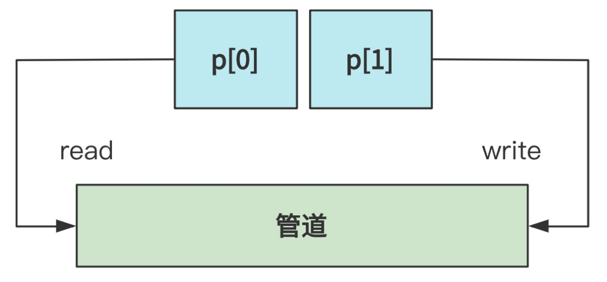

# 解析并指令命令

shell 读取了命令 `cat info.txt | wc -l ` 后，调用 `runcmd` 来执行；

## 1. 解析命令

````c
// xv6-public sh.c
int main(void) {
    static char buf[100];
    // 读取命令
    while(getcmd(buf, sizeof(buf)) >= 0){
        // 创建新进程
        if(fork() == 0)
            // 执行命令
            runcmd(parsecmd(buf));
        // 等待进程退出
        wait();
    }
}
````

`parsecmd` 会把字符命令解析为一个 `struct cmd` 结构体，再交给 `runcmd`：

## 2. 执行命令

````c
// xv6-public sh.c
void runcmd(struct cmd *cmd) {
    ...
    switch(cmd->type) {
        ...
        case EXEC:
        ecmd = (struct execcmd*)cmd;
        ...
        exec(ecmd->argv[0], ecmd->argv);
        ... 
        break;
    
        case REDIR: ...
        case LIST: ...
        case PIPE: ...
        case BACK: ...
    }
}
````

### 2.1 根据命令类型分类

在 `runcmd` 中，首先对解析完毕的 `struct cmd` 结构体，根据其中的 `type` 字段：

- `EXEC`：直接执行；
- `LIST`：命令是由 `;` 间隔的多条命令，那么把整个命令查分成多个，分别递归调用 `runcmd`；
- `PIPE`：命令中包含 `|` 是管道命令，以 `|` 为分界，把命令拆成两个并发的命令，通过管道串联起输入端和输出端，来执行；
- ....

此时输入的 `cat info.txt | wc -l` 就是一个管道命令；

管道命令的含义是将 `|` 左侧命令的输出作为右侧命令的输入；

这里就进入了 `PIPE` 分支：

````
// xv6-public sh.c
void runcmd(struct cmd *cmd) {
    ...
    int p[2];
    ...
    case PIPE:
        pcmd = (struct pipecmd*)cmd;
        pipe(p);
        if(fork() == 0) {
            close(1);
            dup(p[1]);
            close(p[0]);
            close(p[1]);
            runcmd(pcmd->left);
        }
        if(fork() == 0) {
            close(0);
            dup(p[0]);
            close(p[0]);
            close(p[1]);
            runcmd(pcmd->right);
        }
        close(p[0]);
        close(p[1]);
        wait(0);
        wait(0);
        break;
    ...
}
````

### 2.2 创建管道

进入 `PIPE` 分支后，首先创建一个匿名管道，

````c
void runcmd(struct cmd *cmd) {
    ...
    int p[2];
    ...
    case PIPE:
        pcmd = (struct pipecmd*)cmd;
        pipe(p);
    ...
}
````

> PS：匿名管道的相关内容在第三章有介绍，具体其工作原理，这里不多说，但当时没有说明 `pipe` 的实现细节，这里展开说明：
>
> `pipe` 也是系统调用，最后调用到 `sys_pipe`：
>
> ```c
> // fs/pipe.c
> int sys_pipe(unsigned long * fildes) {
>     struct m_inode * inode;
>     struct file * f[2];
>     int fd[2];
> 
>     for(int i=0,j=0; j<2 && i<NR_FILE; i++)
>         if (!file_table[i].f_count)
>             (f[j++]=i+file_table)->f_count++;
>     ...
>     for(int i=0,j=0; j<2 && i<NR_OPEN; i++)
>         if (!current->filp[i]) {
>             current->filp[ fd[j]=i ] = f[j];
>             j++;
>         }
>     ...
>     if (!(inode=get_pipe_inode())) {
>         current->filp[fd[0]] = current->filp[fd[1]] = NULL;
>         f[0]->f_count = f[1]->f_count = 0;
>         return -1;
>     }
>     f[0]->f_inode = f[1]->f_inode = inode;
>     f[0]->f_pos = f[1]->f_pos = 0;
>     f[0]->f_mode = 1;       /* read */
>     f[1]->f_mode = 2;       /* write */
>     put_fs_long(fd[0],0+fildes);
>     put_fs_long(fd[1],1+fildes);
>     return 0;
> }
> ```
> 可以佐证，整个流程与进程打开一个文件的步骤类似：
>
> .png)
>
> 会先在进程结构体的 `file` 数组中找到两个空闲的文件描述符，然后在系统中也找两个，对应起来；之后使用 `get_pipe_inode` 创建一个管道 inode，把 inode 交给两个文件描述符，一个读、一个写；
>
> 而 `get_pipe_inode` 
>
> ```c
> // fs.h
> #define PIPE_HEAD(inode) ((inode).i_zone[0])
> #define PIPE_TAIL(inode) ((inode).i_zone[1])
> 
> // inode.c
> struct m_inode * get_pipe_inode(void) {
>     struct m_inode *inode = get_empty_inode()；
>     inode->i_size=get_free_page()；
>     inode->i_count = 2; /* sum of readers/writers */
>     PIPE_HEAD(*inode) = PIPE_TAIL(*inode) = 0;
>     inode->i_pipe = 1;
>     return inode;
> }
> ```
>
> 也并不复杂，需要注意：正常文件的 inode 中的 i_size 表示文件大小，而管道类型文件的 i_size 表示供管道使用的这一页内存的起始地址；

执行后 `p[0]` 是管道的读端，`p[1]` 是管道的写端；



### 2.3 创建子进程

匿名管道只能在有关系的进程之间使用，所以之后就是创建了两个子进程用来执行两个任务；

`fork()` 后，子进程会复制父进程的文件描述符，所以现在有这样的结构：

.png)

而由于每个进程的前三个文件描述符分配给：标准输入，标准输出、标准错误输出，所以完整的结构为：（父进程没有给出）

.png)

现在来到进程的代码，对第一个子进程：

````c
...
if(fork() == 0) {
    close(1);
    dup(p[1]);
    close(p[0]);
    close(p[1]);
    runcmd(pcmd->left);
}
...
````

- 首先关闭 1 号，即标准输出文件描述符；

- 使用 `dup` 将管道的写端复制到 1 号文件描述符的位置，`p[1]` 与 1 号文件描述符都指向管道的写端（PS：`dup` 函数的作用在第二章）；

    此时进程的 `printf` 标准输出就会到管道的写端；

- 关闭 `p[1]`；

- 关系 `p[0]`，避免阻塞，这个进程只负责写，不读管道；

- 递归执行 `runcmd(pcmd->left)`，运行 `|` 左侧是命令；

现在文件结构为（省略了 0 与 2 号文件描述符）：

.png)

对右侧进程也是同理：

````c
...
if(fork() == 0) {
    close(0);
    dup(p[0]);
    close(p[0]);
    close(p[1]);
    runcmd(pcmd->right);
}
````

- 首先关闭 0 号，即标准输入文件描述符；

- 使用 `dup` 将管道的**读端**复制到 0 号文件描述符的位置，`p[0]` 与 0 号文件描述符都指向管道的**读端**；

    此时进程的 `scanf` 标准输入就会到管道的读端；

- 关闭 `p[0]`；

- 关系 `p[1]`，避免阻塞，这个进程只负责读，不写管道；

- 递归执行 `runcmd(pcmd->right)`，运行 `|` 右侧是命令；

最后得到：

.png)

### 2.4 关闭父进程的管道

而对父进程，只负责创建管道与子进程，本身不使用管道，所以就把文件描述符关闭：

````c
// xv6-public sh.c
void runcmd(struct cmd *cmd) {
    ...
    pipe(p);
    if(fork() == 0) {...}
    if(fork() == 0) {...}
    // 父进程
    close(p[0]);
    close(p[1]);
    ...
}
````

忽略父进程，最终，就是创建了两个进程，左边的进程的标准输出指向了管道（写），右边的进程的标准输入指向了同一个管道（读）：

.png)

## 3. 分别执行命令

之后在两个进程中递归执行 `runcmd`，而最后总是回到 `EXEC` 可执行的命令；

而在 `EXEC` 分支最后就是调用了 `exec` 方法，之前已经说过，来到 `sys_execve` ，经过加载，执行了具体的程序；
